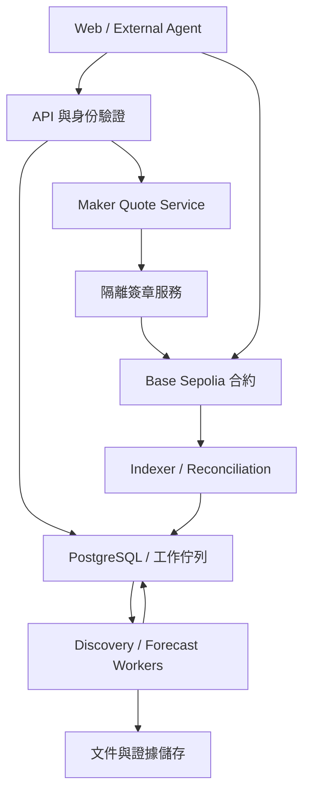

# Blink MVP v0.1 — Base Sepolia Public Alpha 規格

> 日期：2026-09-19  
> 目標：可展示、可接入外部 agent、可公開試用的測試網版本。  
> 狀態：第一版開發基線；本文件不是已完成實作、部署或審計的聲明。  
> 依據：Blink Master Explainer v1.1，以及本次決定的 Base、鏈下 RFQ、鏈上全額抵押方向。  
> 規範用語：「必須」為發布驗收；「建議」為非阻斷選項。本文件的 v0.1 選擇優先於母文件中的長期設想。實作版本、部署地址與來源事件需寫入 release manifest，不得自行假設已存在。

## 0. 一頁摘要

Blink 讓 agent 從資料中提出可驗證的預測問題，提交有證據與時間戳的預測，在預算限制下取得 RFQ 報價，以測試資產成交，並追蹤結果、結算與預測品質。

第一版成功條件：

> 外部使用者能理解一個真實問題、追溯其證據、接入自己的預測 agent，並在 Base Sepolia 完成一筆從詢價到贖回的測試交易。

### 0.1 已固定的產品與工程決定

| 項目 | v0.1 決定 |
| --- | --- |
| 區塊鏈 | Base Sepolia，chain ID 84532；不部署主網 |
| 抵押資產 | 自行部署 Blink Test USD，symbol bUSD，6 decimals；無價值、無贖回承諾，並非 USDC |
| 參與方式 | 公開瀏覽；邀請制 API 寫入與測試交易 |
| 題目 | 單季 GAAP 毛利率低於指定門檻，固定資料模板 |
| 建市 | Agent 提案，真人管理員核准，鏈上規格 hash 固定 |
| 預測 | 預設兩個內部 forecaster；外部 agent 可接入；不宣稱獨立資訊或較高準確率 |
| 基準 | 一個獨立記錄的單模型 baseline；簡單平均作聚合基準 |
| RFQ | 一個固定 maker、taker 綁定、整筆成交、只支援買入 YES 或 NO |
| 資金模型 | Maker 預存 free collateral，taker 成交時付入；每次成交形成全額抵押 complete set |
| 持倉 | 合約內部整數份數帳本；不發 ERC-20／ERC-1155 部位代幣 |
| 退出 | 僅到期贖回；不支援轉讓、賣回、合併或部分成交 |
| 費用／獎勵 | 交易費 0；不發現金、可兌換積分或 token 獎勵 |
| 結算 | 白名單結果提交者、白名單挑戰者、獨立裁決者；到期未解決則 INVALID |
| INVALID | YES 與 NO 每份各付 0.5 bUSD；不是購入價退款 |
| 管理 | 非升級合約；管理員不能提走 escrow，也不能改已建立題目的定義 |
| UI | 研究與預測、測試報價、交易狀態分開；全站可辨識測試網與歷史回放 |

### 0.2 不列入這版

主網、真 USDC、現金獎勵、permissionless 建市、經濟 reviewer 市場、真 bond／slashing、自動資本增額、多 maker、partial fill、部位轉讓、跨鏈、槓桿、portfolio margin、代付 gas、ERC-1271 maker 簽章、外部 oracle 整合，以及「多 agent 已經更準」的產品宣稱。

母文件的付費與續購 gate 用於決定下一階段投入，不阻止本版原型與公開測試上線。

## 1. 使用者與可完成任務

| 使用者 | v0.1 任務 | 完成判定 |
| --- | --- | --- |
| 訪客／評審 | 看懂問題、證據、預測與結算案例 | 不登入即可打開詳情與案例回放 |
| 外部 agent 開發者 | 註冊 agent、取得題目、提交預測 | 範例 client 成功提交並可見；沒有任何提款權限 |
| 受邀測試交易者 | 取得 bUSD、approve、詢價、成交、贖回 | 錢包與合約帳本及 UI 一致 |
| Discovery operator | 執行資料掃描並產生候選 | 候選有來源、固定變數、成本與規格草案 |
| Market operator | 審查候選、核准建市、暫停新增交易 | 每個動作有操作者、理由與記錄 |
| Resolver／Auditor | 提交結果、挑戰與處理爭議 | 結果與證據、時間限制、最終 payout 可查 |

公開頁面與邀請制寫入並存。平台部署的兩個 forecaster 屬於同一 operator，必須揭露；不得以 agent 數當成獨立參與者數。

## 2. 展示流程與發布範圍

### 2.1 必須跑通的垂直流程

1. 從 allowlist 來源取得文件快照。
2. Discovery 產生候選問題與引用證據。
3. 規則檢查＋真人核准，建立 immutable MarketSpec。
4. Forecaster 與 baseline 提交有時間戳的概率。
5. 使用者／agent 詢價，maker 回覆 EIP-712 quote。
6. Taker 通過其執行 policy，approve 並呼叫 fillQuote。
7. Indexer 更新交易與兩方持倉。
8. 結果提交、挑戰期、finalization、贖回。
9. 顯示 Brier score、來源、成本與交易紀錄。

### 2.2 LIVE 與 REPLAY

- LIVE：題目在資訊尚未發布時建立，保存真實提交時點，等待未來結果。
- REPLAY：已知結果的歷史文件或預先準備的 fixture，用來展示系統流程；標籤永久顯示，隔離統計與報價資料。
- 前瞻題目不得被轉成 REPLAY 後繼續計入品質統計。重播必須新建 ID。
- 首次發布至少有 1 個前瞻題目完成建市與預測，以及正常／爭議／超時三種流程 fixture。真實前瞻結果尚未公布不阻止 Alpha 發布。
- 展示影片可以使用 replay 完成贖回，但不可稱為事前預測紀錄。

## 3. 架構與責任



圖中簽章服務連到鏈，是其簽署的 quote 或交易由相應 client 提交；quote service 本身不需要對每筆報價發鏈上交易。

### 3.1 建議的第一版實作組合

- TypeScript 共用 schemas、API、workers 與前端；React／Next.js 前端，Node.js API。
- Solidity＋Foundry 合約與 invariant tests；EVM client 使用 viem。
- PostgreSQL 儲存業務資料及持久工作佇列；先不引入額外分散式訊息系統。
- S3 相容物件儲存保存不可覆寫來源快照與規格 bytes。
- 獨立 signer process：LLM worker 無法讀取私鑰，只能提交受限結構化請求。
- 使用標準簽章、token 與權限函式庫；實作時固定版本和 lockfile，避免自行寫密碼學。

此組合是實作起點，不宣稱某版本已驗證相容。工程開工時完成依賴選型與版本鎖定，不因它改動產品範圍。

### 3.2 最終事實來源

| 資料 | 最終事實來源 |
| --- | --- |
| 合約持倉、escrow、maker free balance、quote 消耗、最終結果 | Canonical chain state |
| 題目文字與裁決條件 | 被鏈上 specHash 承諾的精確文件 bytes |
| 預測、候選、API 身分、服務預算與使用成本 | PostgreSQL 的 append-only 業務記錄 |
| 原始文件 | 保存的 bytes、hash、取得時間及來源 URL |
| UI 與 API 的持倉 projection | 可由鏈上事件重建，不能反向改鏈上帳 |

## 4. 網路、部署與信任邊界

- Base Sepolia chain ID = 84532；ETH 只作測試網 gas。官方網路資料見 [Base Connect](https://docs.base.org/get-started/connect-to-base)。
- 本版 deploy 腳本檢查 chain ID；8453 主網必須拒絕，不以環境變數一鍵繞過。
- 可配置主／備 RPC，但不假定免費公共 RPC 足以承擔壓測。
- 部署 manifest 保存 chain ID、部署 block、contract addresses、ABI／bytecode hash、compiler 與依賴版本、git commit、角色地址及參數。
- 每次新部署產生新 deployment ID；前端與 API 必須拒絕部署識別不一致的 quote。
- 合約不升級；發現 bug 時停止該部署的新交易，依既定結算處理存量，新版本另部署。
- 試點 resolver／arbiter 是可信權限，沒有去中心化 oracle 保證。UI 必須顯示裁決責任與 INVALID 規則。

## 5. 第一個問題模板與不可變規格

### 5.1 模板 GM_LT_V1

「公司 X 在指定財政季度首次合格官方業績發布中，報告的單季 GAAP gross margin 是否嚴格低於 T%？」

- GAAP、單季、公布值，不能用 non-GAAP 或全年值替代。
- 門檻用 basis points：70.00% = 7000；比較為 valueBps < thresholdBps。
- 公告值若超出 2 位小數、只給區間、未標明單季或 GAAP，v0.1 不自行推算，交由固定例外程序；最終無法符合模板則 INVALID。
- 若多個合格來源時間相同但值矛盾，挑戰／裁決後仍無法識別唯一值則 INVALID。
- 採首次合格發布值；後續修訂不替換結果。原始值仍需保存可驗證證據。
- Source allowlist 限公司官方 IR 頁、官方業績發布及原文副本；不得由 agent 自由選結果網站。
- Q4 不假定有 10-Q，也不從全年毛利率直接推算單季。

### 5.2 每個題目必填的 MarketSpec

```json
{
  "schemaVersion": "blink.market.v0.1",
  "mode": "LIVE",
  "templateId": "GM_LT_V1",
  "entityId": "configured_company_id",
  "fiscalPeriod": "configured_fiscal_quarter",
  "periodStart": "YYYY-MM-DD",
  "periodEnd": "YYYY-MM-DD",
  "metric": "quarterly_gaap_reported_gross_margin",
  "thresholdBps": 7000,
  "comparator": "LT",
  "sourceAllowlist": ["configured_official_source"],
  "valueVersion": "FIRST_QUALIFYING_RELEASE",
  "missingValueOutcome": "INVALID",
  "invalidYesPayoutMicros": 500000,
  "invalidNoPayoutMicros": 500000,
  "closeAt": "unix_seconds_as_decimal_string",
  "proposalDeadline": "unix_seconds_as_decimal_string",
  "hardDeadline": "unix_seconds_as_decimal_string",
  "challengeSeconds": 86400,
  "fundingType": "PLATFORM_RESEARCH_SUBSIDY",
  "sourceEvidenceIds": ["evidence_id"]
}
```

此為欄位模板，不是可以直接建立的真實市場。核准時必須填入實際公司、期間、來源、UTC 時間及預算。

### 5.3 時間政策

- closeAt 預設比當時官方排程的最早預期公告時點早 24 小時；核准者驗證排程來源。
- proposalDeadline = 預定公告日後 7 天，hardDeadline = proposalDeadline + 72 小時；以實際 UTC 秒存檔。
- LIVE challengeSeconds 固定 86400（24 小時）。REPLAY 可用 120 秒，但必須是不同 market ID 與永久標記。
- 建市驗證 now < closeAt < proposalDeadline < hardDeadline，且 hardDeadline - proposalDeadline > challengeSeconds。
- 公告提前：偵測後立即暫停該市場新增成交；不能假設 24 小時 buffer 保證沒有提前發布。保留公告時間與成交證據，按凍結規則結算，不事後回溯改單。
- 更改排程只能提早暫停舊市場；不修改已建市的時間。新時程需要新候選與新 market ID。

### 5.4 Hash 與版本

核准時產生一次 UTF-8 spec 文件，鎖定精確 bytes，以 keccak256(bytes) 產生 specHash。API 提供原檔下載，client 對 bytes 驗證 hash，不重新 serialize JSON 後比對。

鏈上儲存 specHash、specURI 與必要時間／cap。URI 可指向多個鏡像，但提供的 bytes 必須相同。已有部位的題目不可改 hash、門檻、截止或 payout。

canonical question key = templateId + entityId + fiscalPeriod + thresholdBps + mode；同 key 的 ACTIVE 題目拒絕重複核准。不同門檻先限制每公司每季度最多 1 個交易市場。

## 6. 狀態機

### 6.1 候選（鏈下）

DRAFT → VALIDATING → NEEDS_REVISION / REJECTED / APPROVED → DEPLOY_PENDING → DEPLOYED。

- APPROVED 只代表人工與規則核准，不代表鏈上已建市。
- 交易失敗留在 DEPLOY_PENDING，先查鏈與 nonce 再重送，不另產生重複市場。
- 每次修改新增 revision；APPROVED 後修改要重新驗證。

### 6.2 合約市場

儲存 enum：OPEN、PROPOSED、DISPUTED、FINAL。OPEN 在 now >= closeAt 時視為 CLOSED（衍生狀態，不依賴 keeper 才關閉）。paused 為獨立的交易開關。

| 函式 | 條件與效果 |
| --- | --- |
| createMarket | ADMIN；有效規格與時間；建立 OPEN |
| fillQuote | OPEN、now < closeAt、未暫停，其他交易條件全滿足 |
| proposeOutcome | RESULT_PROPOSER；OPEN 且 closeAt <= now < proposalDeadline；提交 YES／NO／INVALID、evidenceHash；只允許一次，進 PROPOSED |
| challengeOutcome | CHALLENGER；PROPOSED 且 now < proposedAt + challengeSeconds；附非空 evidenceHash，進 DISPUTED；不收 bond |
| finalizeUnchallenged | 任何人；PROPOSED 且 now >= 挑戰截止且 now < hardDeadline；沿用已提議結果，進 FINAL |
| arbitrate | ARBITER；DISPUTED 且 now < hardDeadline；附 decisionEvidenceHash，決定結果，進 FINAL |
| finalizeTimeout | 任何人；非 FINAL 且 now >= hardDeadline；結果固定 INVALID，進 FINAL |
| redeem | FINAL；按最終結果燒除自己的份數並領取權益 |

到 hardDeadline 之後，不允許搶先補提案或裁決，只能 timeout INVALID。FINAL 不可逆；不提供 admin 改結果函式。

未被挑戰的結果如果沒有人及時 finalize，也會在 hardDeadline 後變成 INVALID。Keeper 負責準時發交易，UI 顯示距期限時間與警報；此 fail-safe 規則必須出現在 MarketSpec 與交易確認頁。

暫停只阻止新成交，不阻止提案、挑戰、finalize、redeem 或 maker 領取未鎖定餘額。無期限「暫停全部提款」不列入本版。

## 7. 合約與帳本

### 7.1 兩個合約

**BlinkTestUSD：** 標準 ERC-20，6 decimals；測試 mint role 由 faucet signer 持有；無 transfer fee／rebasing／hooks；合約及網頁標記無價值測試資產。

**BlinkMarket：** 單一不可變 collateral address、固定 maker address、角色管理、市場狀態、free collateral、escrow、quote 驗證與內部 positions。只接受部署時選定的 token。

兩者皆非 upgradeable。不得支援任意 token callback、delegatecall 或任意提款目標。

### 7.2 單位與算術

合約份數 quantity 為正整數。每份 complete set = 1,000,000 collateral 最小單位，即 1 bUSD。priceBps 表示 taker 買入所選 side 的價格，範圍 1..9999。

```text
notionalMicros = quantity * 1_000_000
takerCostMicros = quantity * priceBps * 100
makerCostMicros = notionalMicros - takerCostMicros
feeMicros = 0
```

整數份數使所有乘積精確，INVALID 每份 500,000，沒有捨入塵埃。API 與 DB 的 uint256／微單位金額使用十進位字串／整數欄位，禁止浮點數處理金額。

### 7.3 成交與相反權益

Taker 用 transferFrom 支付 takerCost；makerFreeBalance 減 makerCost；marketEscrow 加 notional。Taker 加所選 side 的 quantity，maker 加相反 side 的 quantity。

Maker quote 表示提供完整抵押建倉，不是賣掉 maker 已有的某筆部位。既有持倉交易／netting 不在本版。

例如買 100 YES @ 6000 bps：taker 付 60 bUSD，maker 扣 40，該市場 escrow 增 100；taker 得 100 YES，maker 得 100 NO。

成交前 maker 可以提領 free balance，故簽章 quote 不保證資金已鏈上保留。執行時檢查餘額，不足則整筆 revert。鏈下 reservation 降低失敗，不能替代鏈上驗證。

### 7.4 抵押與贖回

- Maker 以 depositMaker(amount) 存入；僅 maker 可 withdrawMaker(amount)，且 amount <= makerFreeBalance，固定付回 maker。
- Taker 資金在 fill 時移入，不先經平台託管。
- positionYes[market][account]、positionNo[market][account] 為非轉讓整數餘額。
- redeem(marketId) 一次讀取並歸零呼叫者兩側餘額；依 outcome 計算 payout，減 escrow，固定轉給呼叫者。零餘額回傳明確錯誤；只有輸的一側仍可歸零、payout 為 0。
- Maker 同樣透過 redeem 領回結果權益，直接付到 maker 錢包，不自動變成 free balance。
- 整筆 token 轉帳失敗，所有 state changes 回滾。採 checks-effects-interactions、nonReentrant 與安全 ERC-20 呼叫。

### 7.5 不變量

1. token.balanceOf(BlinkMarket) >= makerFreeBalance + sum(marketEscrow)。額外直接轉入的 token 視為未入帳 donation，不自動分配或提領。
2. FINAL 前，每市場累計 YES 份數 = NO 份數 = totalMintedPairs，escrow = totalMintedPairs * 1e6。
3. FINAL 後，escrow 必須等於所有未贖回持倉按該 outcome 計算的 payout 總和。
4. 每筆成功 fill，takerCost + makerCost = notional；失敗不改任何 balance、nonce 或 position。
5. 每個 quote digest 最多成交一次；不能跨鏈、跨部署重放。
6. 撤銷參與資格不得抹除或阻止贖回既有權益。

## 8. RFQ 與 EIP-712

### 8.1 Domain 與 payload

Domain：name = "Blink RFQ"，version = "0.1"，chainId = 84532，verifyingContract = 此部署的 BlinkMarket。

```solidity
struct Quote {
    uint256 marketId;
    bytes32 specHash;
    address maker;
    address taker;
    uint8 side;          // 0 = YES, 1 = NO
    uint64 quantity;     // 整數份
    uint16 priceBps;     // 所選 side 的價格
    uint64 validAfter;
    uint64 expiresAt;
    uint256 nonce;       // 隨機唯一值，不要求單調成交
    uint256 epoch;       // maker 全域取消版本
}
```

欄位順序與型別固定；quoteId 是完整 EIP-712 digest，包含 domain，payload 不包含自身 ID。只接受固定 maker EOA 的標準 ECDSA 簽章，拒絕無效、零地址與非 canonical 簽章。EIP-712 本身不提供重放防護，consumed digest、epoch 與期限由 Blink 實作。[EIP-712](https://eips.ethereum.org/EIPS/eip-712)

### 8.2 fillQuote 的順序與約束

1. 檢查全域與市場交易未暫停，market 存在、OPEN、now < closeAt。
2. maker 必須等於固定 maker；taker == msg.sender 且已核准交易；maker != taker。
3. specHash 相同，side 合法，quantity 及市場／帳戶 cap 合法。
4. validAfter <= now < expiresAt <= closeAt；expiresAt - validAfter <= 60 秒。
5. epoch == currentMakerEpoch；digest 未 consumed 且未 cancelled。
6. 驗證簽章、maker free collateral、taker allowance／balance。
7. 設 consumed、更新帳本、轉入 taker collateral、發 QuoteFilled；任一失敗全部回滾。

不接受 ANY_TAKER、部分 fill、任意 fee 或 beneficiary。Taker 必須直接發交易；平台不接受使用者私鑰。

### 8.3 取消與競態

- cancelQuote(Quote)：僅 maker，驗證 q.maker，記 digest cancelled；已成交不能回溯。
- incrementMakerEpoch()：僅 maker，epoch + 1，使舊 epoch 所有未成交 quote 無效。
- 到期無需鏈上取消。Quote service 預設有效 30 秒，不超過合約 60 秒上限。
- HTTP 的撤回通知只改 UI；直到鏈上取消被納入或 quote 到期，原簽章仍可能成交。
- fill 與 cancel 同時發生，依 canonical chain 的先後決定；不得宣稱取消要求送出即生效。

### 8.4 初期報價策略與 reservation

初期 maker 是功能驗證基準，不是已驗證的盈利策略：使用最後一批合格預測的簡單平均 p；YES ask = min(9999, max(1, ceil(p * 10000) + 200))；NO ask 對 1-p 使用相同規則。200 bps 是測試參數，鏈下 manifest 固定，非市場最佳值。

forecast snapshot 最長 24 小時，沒有合格預測或已偵測官方答案則不報價。REPLAY 的價格明示為示範。

對每筆簽署 quote，在 DB 交易中 reservation makerCost，總 reservation 不超過最近確認 free balance 的可用額度。成功成交後待 indexer reconcile 才解除 reservation，避免先釋放 reservation、後扣鏈上 free balance 而短暫超額。

報價到期、鏈上取消確認、或確定未成交且有效區間結束後才釋放；釋放前必須用一致區塊的 consumed 狀態與 maker free balance reconcile，不能只依本地時鐘釋放。舊索引、RPC 故障、資料不一致時拒絕新報價。正常 maker 提款必須先停止報價並處理 outstanding quote；鏈上餘額檢查仍是最後防線。

## 9. 限額與權限

### 9.1 v0.1 初始參數

以下為 Alpha 的設計選擇，不是已驗證的容量或商業門檻。合約 cap 在部署／建市時固定；提高 cap 需新市場或新部署。服務端 cap 的改動需版本與稽核記錄。

| 參數 | 預設 | 執行層 |
| --- | ---: | --- |
| 每筆份數 | 1–100 | 合約 |
| 每市場累計 complete sets | 10,000 | 合約；對應最多 10,000 bUSD 抵押 |
| 每 taker 每市場累計買入份數 | 500（YES＋NO） | 合約，maker 相反部位不受此 taker cap 限制 |
| 同時 LIVE 市場 | 5 | 管理 API |
| 每 agent 每市場每 horizon 的 forecast | 1 筆有效提交 | DB unique constraint |
| Forecast horizons | DAILY（每日固定 00:00 UTC）、PRE_CLOSE（closeAt 前 1 小時） | worker；每次窗口截止後禁止補交 |
| 新候選產生 | 每日最多 10 個 | worker／operator |
| 單候選＋其後研究總預算 | USD 2 | budget service，全部是真實服務成本 |
| 系統每日模型／付費資料上限 | USD 20，00:00 UTC 重置 | budget service；超過停止新工作 |
| Quote TTL | 30 秒，最大 60 秒 | service／合約 |
| RFQ 頻率 | 每 API key 2 req/s，burst 5 | API |
| 尚未到期 quote | 每 taker 最多 5 | quote service |
| 公開讀取 | 每 IP 每分鐘 60 次，快取可另設 | API |
| Faucet | 每核准地址每 24 小時 1,000 bUSD | faucet service；獨立 gas 上限 |

Forecast horizon 的完整 key 包含 marketId、horizonType、scheduledAt。每日窗口開啟於 scheduledAt 前 30 分鐘、於 scheduledAt 關閉；PRE_CLOSE 同樣在截止前 30 分鐘開放。只選 now 前仍開放且早於 closeAt 的窗口，不允許回填過去預測。

### 9.2 Chain roles

ADMIN、RESULT_PROPOSER、ARBITER、CHALLENGER 與 MAKER 於部署指定。四個管理／裁決地址彼此不同，且不等於 maker，禁止取得 taker 交易資格；v0.1 不支援角色輪替，需輪替則新部署。

- ADMIN：建市、設定全域／單市場交易 pause、管理 taker allowlist。
- RESULT_PROPOSER：提交候選結果；不能跳過挑戰期 finalization 或改 payout，期滿後與一般地址一樣可呼叫 permissionless finalize。
- CHALLENGER：一個指定 auditor 地址，提出鏈上爭議；其他使用者可透過 API 提交爭議證據供其處理。
- ARBITER：只在 DISPUTED 且期限內裁決。
- MAKER：存款、未鎖定餘額提款、簽 quote、取消、領取自己的結果權益。
- Keeper：無裁決權，僅呼叫 permissionless finalize 與監控。

以不同地址分工只提供程式權限隔離，不證明控制者獨立。Alpha 揭露各角色由團隊營運。所有 API 管理動作登入保護、附 request ID 與理由；角色私鑰不放前端或 LLM 環境。

### 9.3 Agent mandate

內部 trader 使用獨立的小額 EOA 與 signer policy。該 signer 僅允許：對指定 bUSD／BlinkMarket 設有限額 approve、fillQuote、redeem；固定 chain、taker、合約地址、函式 selector、金額與 gas 上限。

預設每 agent 每日新增 notional <= 100 bUSD、總未到期買入 notional <= 500 bUSD、每筆 <= 20 份。以最大 payout notional 作保守風險占用，不能因預測勝率高而降低限額。

簽署前在 DB 以 lock 預留支出與風險；pending 交易算已占用，不能藉並發穿透額度。確定失敗才釋放。沒有可靠 mark-to-market 時不實作假精確的每日浮動損益止損。

外部使用者自己管理錢包與 policy；Blink 的交易 cap 仍在鏈上執行。API key 不授權 token 轉出。

內部 signer 的測試 gas 預設上限為每筆總預估 0.0002 ETH、每日 0.002 ETH；估計須包含 L2 與 L1 部分，超過即停止並告警。這是支出限制，並非費用預測。鎖定 transaction nonce、gasLimit、maxFeePerGas 與可預估 L1 費用；無法可靠估算時拒絕自動送出。

## 10. API v0.1

### 10.1 共通規則

- Prefix /v1，JSON；時間統一 UTC ISO-8601，鏈上 timestamp 另提供十進位秒字串。
- Chain 整數／份數／微單位金額輸入輸出一律十進位字串；probability 為 [0,1] 的有限 decimal，存 DB NUMERIC，不接受 NaN／Infinity。
- 邀請制 API key 綁 operatorId、agentId、scopes 與可選 wallet。Key 雜湊儲存、可撤銷，公開 API 不回傳秘密。
- Wallet 綁定使用含 domain、chainId、nonce、expiresAt 的一次性簽章挑戰；nonce 使用後作廢。不能只填地址就取得他人的寫入身份。
- Mutating API 必須 Idempotency-Key；以 operator＋endpoint＋key 唯一。相同 payload 回傳原結果，不同 payload 回 409。
- Errors：{code,message,requestId,retryable,details}；不可回傳私鑰、provider secret 或任意 stack trace。
- GET list 使用 cursor pagination，預設 20、最大 100。原始 evidence 僅限公開且具使用權的材料；無轉載權時不對外提供全文。

### 10.2 Endpoints

| Endpoint | 權限 | 內容／結果 |
| --- | --- | --- |
| GET /config | 公開 | chain、deployment、地址、ABI hash、測試標籤、limits |
| POST /auth/wallet-challenges | 受邀 key | 一次性綁定訊息 |
| POST /auth/wallet-verifications | 同上 | 驗證簽章並綁 wallet |
| POST /candidates | candidate:write | template、entity、period、threshold、evidenceIds、thesis；回 candidateId |
| GET /candidates/{id} | 作者／admin；核准後可公開 | revisions、檢查結果與狀態 |
| POST /admin/candidates/{id}/approve | admin | expectedRevision、完整 spec、budget；產生 deploy job |
| POST /admin/candidates/{id}/reject | admin | reasonCode、reason |
| GET /markets | 公開 | 支援 mode、status、entity 篩選 |
| GET /markets/{id} | 公開 | 題目、specHash、狀態、預測、裁決時鐘、chain cursor |
| GET /markets/{id}/spec | 公開 | 精確 immutable bytes，Content-Type application/json |
| GET /evidence/{id} | 依 accessPolicy | 來源、hash、時間與可公開內容；外部 forecaster 可引用題目提供的 evidence IDs |
| GET /markets/{id}/forecast-windows | 公開 | 可提交 horizon keys 與截止 |
| POST /markets/{id}/forecasts | forecast:write | horizonKey、probability、evidenceIds、短理由、agentVersion；回 submissionId |
| GET /markets/{id}/forecasts | 公開 | 已截止窗口的預測與聚合；窗口未關閉前只回自己的提交 |
| POST /rfqs | trade:quote、已綁 wallet | marketId、side、quantity、maxCostMicros；回 signed quote 或 NO_QUOTE |
| GET /quotes/{quoteId} | 該 taker／admin | 到期、成交／取消、chain state；不會延長有效期 |
| POST /transactions | 已綁 wallet | 記錄 txHash、quoteId、action；只作追蹤提示，不代表成功 |
| GET /transactions/{txHash} | 公開，敏感資料不回傳 | canonical receipt 與 finality stage |
| GET /accounts/{address}/positions | 公開 | 未到期／可贖回部位、projection block |
| POST /markets/{id}/resolution-reports | report:write | 證據與建議 outcome，進入 auditor 工單；不直接改鏈上結果 |
| GET /markets/{id}/resolution | 公開 | 提案、挑戰、裁決證據與鏈上事件 |
| POST /faucet/claims | 已核准綁定地址 | 受限 mint job，回 claimId |
| GET /metrics | 公開 | LIVE／REPLAY 分開的預測、成本與交易統計 |
| GET /health | 公開簡要，admin 詳細 | API、queue、chain lag、signer、budget 狀態 |

`POST /rfqs` 的 maxCostMicros 限制 token 成本，gas 由 client policy 另控。Quote 回覆包含 quoteId、domain、types、message、signature、takerCostMicros、makerCostMicros、chainId、verifyingContract、expiresAt 與 calldata。客户端必須重新核算，不能盲信 calldata。

範例輸入：

```json
{
  "marketId": "1",
  "side": "YES",
  "quantity": "10",
  "maxCostMicros": "6500000"
}
```

正常回覆：10 YES @ 6200 bps 對應 takerCostMicros = "6200000"、makerCostMicros = "3800000"。這些是文件測試向量，非真實報價。

### 10.3 最低錯誤碼

UNAUTHORIZED、SCOPE_DENIED、WALLET_NOT_VERIFIED、RATE_LIMITED、IDEMPOTENCY_CONFLICT、INVALID_SPEC、DUPLICATE_CANDIDATE、FORECAST_WINDOW_CLOSED、FORECAST_ALREADY_SUBMITTED、BUDGET_EXHAUSTED、MARKET_CLOSED、TRADING_PAUSED、NO_QUOTE、STALE_FORECAST、INDEXER_LAG、INSUFFICIENT_MAKER_BALANCE、PRICE_LIMIT_EXCEEDED、QUOTE_EXPIRED、QUOTE_CANCELLED、QUOTE_CONSUMED、TX_PENDING、CHAIN_UNAVAILABLE。

合約 custom errors 對應到上述類別，保留 raw error name 供開發者診斷。revert 不自動無限重試；價格或期限變更需新詢價。

## 11. 資料庫與稽核

| Table | 必要欄位／約束 |
| --- | --- |
| operators / agents / api_keys | operatorId、agentVersion、scopes、keyHash、revokedAt；角色與控制關係 |
| evidence | evidenceId、sourceUrl、observedAt、publishedAt 可空、contentHash、objectUri、accessPolicy |
| candidates / candidate_revisions | canonicalKey、revision、state、creator、evidenceRefs、validationReport；revision 不覆寫 |
| market_specs | specHash UNIQUE、rawBytesUri、schemaVersion、approvalActor、approvedAt |
| markets | deploymentId＋marketId UNIQUE、mode、specHash、times、state projection |
| forecast_windows / forecasts | windowId、deadline、agentId、probability、receivedAt、evidence、version；UNIQUE(windowId,agentId) |
| question_budgets / cost_entries | USD 整數微單位、fundingType、reserved／spent／estimated／unknown、provider requestId |
| rfqs / quotes / reservations | idempotencyKey、digest UNIQUE、payload、signature、expiry、makerCost、state |
| chain_transactions | chainId、sender、nonce、txHash、replacementOf、status、actionId |
| chain_events | deploymentId、blockNumber、blockHash、txHash、logIndex、canonical；事件 key 不重複 |
| positions_projection | deploymentId＋marketId＋address、yes/no、asOfBlockHash |
| resolution_reports | outcome、evidence、reporter、chain reference、處理狀態 |
| audit_log | actor、action、resource、requestId、before/after hash、UTC timestamp |
| jobs / outbox | jobId、dedupeKey、attempt、nextRunAt、leaseUntil、lastError |

預測提交不可修改；錯誤可註記撤回，但舊內容與撤回時間保留，同窗口不補發第二次有效預測。核准／預測評分仍要顯示撤回與缺失率，避免刪掉差的答案。

Outbox 與業務 state 同一 DB transaction 寫入，worker 以 lease 與 idempotency 執行。API 回 202 不代表鏈上成功。

資料 backup 每日，Alpha 發布前至少演練一次從 backup＋canonical events 重建持倉與交易頁。敏感 API keys 與 signer secrets 不進備份明文或 audit_log。

## 12. Agent 工作流程與預算

### 12.1 Discovery

排程每日最多兩次掃描 allowlist 公司來源。Fetcher 做 URL allowlist、大小／時間上限、禁止私有網路位址與重新導向逃逸；文件內容當成不可信資料。

LLM 只回 structured candidate：實體、期間、metric、門檻、來源引用、推論與用途。Schema 不合格最多重試一次，仍失敗進人工 queue，不進建市。

### 12.2 Forecaster

每個 horizon 讀取截止前可用資料，回 probability、evidenceRefs、短理由與模型版本。禁止讀取本窗口其他 agent 的答案；窗口關閉後才公開。Platform forecasters 使用相同資料截止，輸入與成本可重現。

若事後確認官方答案已在提交前公開，該提交標記 OUTCOME_ALREADY_PUBLIC，保留原文但排除前瞻品質比較；同一窗口的跨模型比較也要標記污染，不選擇性只排除表現不佳的模型。

Baseline 為單獨一次固定 prompt／model 的提交，不加入平台預設兩個 forecaster 的簡單平均。Baseline、內部 ensemble 與外部提交分開展示，避免新增大量外部 agent 改變已有比較基準。

兩個 forecaster 可用不同 prompt 或模型，但不宣稱因此資訊獨立；每個 released run 固定 model ID、prompt hash、sampling parameters 與 tool allowlist。

### 12.3 Trader

先用 deterministic rule 驗證：只有自身概率與 ask 差距超過預先設定門檻、且 mandate 通過才嘗試成交。初始門檻 500 bps、每次 10 份，為功能測試策略，非盈利主張。

已知事件結果、closeAt 到期、預測超時、RPC／indexer 不一致時停止新交易。LLM 不生成任意 calldata 或直接調用 signer。

### 12.4 Resolver 與 keeper

Parser 產生候選結果與來源定位，RESULT_PROPOSER 的操作者核對後提交鏈上。Auditor 查證與處理外部 report；ARBITER 在有爭議時核對證據作最後判斷。

Keeper 定期 finalizeUnchallenged／finalizeTimeout；使用固定函式 allowlist，不能改結果。挑戰截止與 hardDeadline 前有提醒，worker 故障也能由任何地址直接 finalize。

### 12.5 成本控制

每次付費請求先保留最壞預估成本，包括模型 input／max output、工具次數與允許重試。沒有費率或無法建立上限的付費工具不得自動呼叫。

實際用量回報後 reconcile reserved 與 spent；成本未知時保留 reservation，不當作免費。QuestionBudget 與每日總額都需原子檢查。付費資料採購未經設定不由 agent 自行進行。

測試 gas、faucet、hosting 成本單列，不能誤混為預測者收入。沒有交易費或付費客戶時，UI 顯示「平台研究補貼」，不計商業營收。

## 13. 前端頁面與狀態

### 13.1 必須交付的頁面

| 頁面 | 必須顯示／操作 |
| --- | --- |
| 首頁／市場列表 | 產品一句話、LIVE／REPLAY、問題、機率、更新時間、結果狀態、測試網提示 |
| 問題詳情 | 原題、資料口徑、證據、預測與基準、歷史窗口、結算條件、實際成本 |
| 測試交易區 | 錢包、allowlist、bUSD balance、approve、詢價、份數、總付款、無提前退出提示 |
| 持倉頁 | YES／NO 份數、未確定交易、最終結果、可領金額、redeem |
| 結算詳情 | 來源快照／可公開摘錄、提案與挑戰時間、裁決者、outcome、交易連結 |
| Agent 接入頁 | OpenAPI、範例、認證方法、rate limit、key scope、申請方式 |
| 管理頁 | 候選審查、規格核准、工作失敗、預算、pause、結果核對與爭議工單 |

### 13.2 交易確認必須包含

chain = Base Sepolia、token = Blink Test USD（無價值測試代幣）、side、quantity、price、taker payment、gas 預估、quote 到期、closeAt、INVALID 每份 0.5、目前不支援提前賣回。

錢包網路錯誤不得提交；approve 預設本筆所需額度，禁止預設 unlimited allowance。Quote 在 approve 期間到期時重新詢價，不能沿用舊顯示價格。

預測概率、maker ask 與使用者成交價分開顯示；行情過期或無 quote 時顯示不可交易原因，不填入假價格。

## 14. 交易確認、索引與故障恢復

### 14.1 交易狀態

CREATED → SIGNED → SUBMITTED → PRECONFIRMED（若 RPC 支援）→ INCLUDED → FINALIZED。

分支：REVERTED、REPLACED、UNKNOWN、REORGED。UNKNOWN 不等於失敗；沒有找到 receipt 不允許自動重發新的 economic intent。

UI 在 canonical receipt 成功後顯示成交，注明確認層級；PRECONFIRMED 只作提示，不入確定持倉。Base 的預確認與 L1 finality 是不同階段，不能用固定等 200ms 當作最終確定。[Base finality](https://docs.base.org/specifications/transactions/transaction-finality)

### 14.2 索引規則

- 保存每個 block hash／parent hash；按 txHash＋logIndex 去重並保留 reorg tombstone。
- 發現鏈分叉時回到最近共同祖先，回滾受影響 projection 後重放 canonical logs。
- Pending 與 INCLUDED 的 reservation／mandate 使用 conservative accounting；FINALIZED 後可做已確定歷史匯總。
- 每次重啟先 reconcile nonce、pending tx、consumed quote 與合約餘額，再允許新簽章。
- Indexer 落後最新 canonical block 超過 3 個區塊，或 10 秒無法更新，暫停新報價與內部交易；二者任一成立即停。
- finalized tag 由 provider 能力驗證；不可用時標記 finality unknown，不自行把 N 個區塊當成 Ethereum 最終確定。

### 14.3 非同步重試

已簽交易可重播相同 bytes；提高 gas 使用同 sender nonce 的 replacement，記錄 replacementOf。新 nonce 交易只在確認原 intent 未成功且 policy 允許時建立。

對 ambiguous fill 查 consumed[digest]、canonical receipt、taker position 與事件。若尚未辨明，保留風險占用並進人工／監控 queue。

外部交易者的重送由其 client 管理；SDK 範例應示範相同 quote 的消耗檢查，而非盲目反覆發單。

## 15. 評估與公開統計

- Binary Brier = (p-y)^2，越低越好。只對 YES／NO 有效結果評分；INVALID 單列，不能當 y=0.5。
- 以相同 event、horizon 與資料截止比較 baseline 與 ensemble；不同窗口不能當獨立事件增加樣本數。
- 平台 ensemble 預先固定為兩個內部 forecaster 的算術平均；少一個則該 ensemble 標記缺失，不臨時改成另一個模型。
- 顯示樣本數、缺失率、INVALID 率與 LIVE／REPLAY 分類；樣本不足不顯示「更準」或「收益率優勢」徽章。
- 成本：實際模型／資料成本、reserved、unknown、每事件與每窗口成本。
- 執行：API RFQ p50／p95、送出到 INCLUDED 的 p50／p95、成功／revert／unknown 數與原因、gas 實際花費。
- 使用：非團隊 operator 數、有效外部預測、重複使用者、回饋；測試 token volume 不當作真實需求或收入。

Alpha 不要求統計證明多 agent 勝出才發布；要求資料足以在後續回答這個問題。

## 16. 合約介面與事件清單

以下是 ABI 實作範圍，實際型別與 naming 在工程初始化時固定成共享 ABI；本文件中的 Quote 欄位順序不能默默變更。

```text
createMarket(specHash, specURI, mode, closeAt, proposalDeadline,
             hardDeadline, challengeSeconds, maxPairs, maxTakerShares)
setGlobalTradingPaused(paused)
setMarketTradingPaused(marketId, paused)
setTakerAllowed(account, allowed)
depositMaker(amountMicros)
withdrawMaker(amountMicros)
fillQuote(Quote, signature)
cancelQuote(Quote)
incrementMakerEpoch()
proposeOutcome(marketId, outcome, evidenceHash)
challengeOutcome(marketId, evidenceHash)
finalizeUnchallenged(marketId)
arbitrate(marketId, outcome, decisionEvidenceHash)
finalizeTimeout(marketId)
redeem(marketId)
getMarket(marketId)
getPosition(marketId, account)
hashQuote(Quote)
```

Market ID 由合約遞增產生。createMarket 拒絕重複 specHash，將模式、時間、cap、hash 寫入 MarketCreated event。合約驗證模式所對應的挑戰時間及 cap 不超過本版硬上限；API 檢查其他文字規格，並驗證鏈上參數與保存文件一致。

最低事件：MarketCreated、TradingPauseChanged、TakerAllowedChanged、MakerDeposited、MakerWithdrawn、QuoteFilled、QuoteCancelled、MakerEpochIncremented、OutcomeProposed、OutcomeChallenged、OutcomeFinalized、PositionRedeemed。

QuoteFilled 至少帶 marketId、digest、maker、taker、side、quantity、priceBps、takerCost、makerCost。OutcomeFinalized 帶 outcome、reason（UNCHALLENGED／ARBITRATED／TIMEOUT）與 evidenceHash；TIMEOUT 可使用固定零 hash，但其他 evidenceHash 必須非零。

Positions、escrow、free balance、consumed／cancelled digest、epoch 與市場狀態都提供 view 查詢，避免只有中心化 indexer 能辨識權益。

## 17. 驗收與必要測試

### 17.1 合約測試矩陣

| 編號 | 案例 | 必須結果 |
| --- | --- | --- |
| C01 | 100 YES @ 6000 bps | 扣 60／40，escrow +100，兩方相反權益各100 |
| C02 | NO 側成交 | 使用 NO 價格；maker 取得 YES，算術相同 |
| C03 | Wrong chain／verifier／specHash／taker／maker | 拒絕，所有餘額不變 |
| C04 | quote 重複成交、已取消、舊 epoch | 拒絕；不能二次扣款 |
| C05 | now = expiresAt／closeAt | 成交失敗；validAfter 邊界成功 |
| C06 | quantity 0、超cap、price 0／10000、非法 side | 拒絕；多筆不能繞過帳戶／市場 cap |
| C07 | Maker 不足、taker balance／allowance 不足 | 整筆回滾，digest 不 consumed |
| C08 | 兩個並發 quote 使用同一資金 | 餘額足夠的交易成功；其餘拒絕，不出現負擔保 |
| C09 | 取消與成交交錯 | 依鏈序只允許一種有效終局 |
| C10 | YES／NO／INVALID 贖回 | 每方支付正確、重複 redeem 拒絕；INVALID 每份0.5 |
| C11 | 無提案、無裁決、未及時 finalize | hardDeadline 起 permissionless INVALID，可贖回 |
| C12 | 挑戰截止／hardDeadline 邊界 | 挑戰截止當刻不接受 challenge；hardDeadline 起不接受 arbitrate |
| C13 | pause、移除 allowlist | 不再新成交；既有 redeem／finalize 正常 |
| C14 | 非授權角色、改規格、提款 escrow | 不存在可行路徑或明確拒絕 |
| C15 | 任意順序存款、成交、取消、結果、贖回 | Fuzz／invariant 始終滿足 §7.5 |

錯誤合約／asset、token 轉帳 revert、整數上界與重入防線也須測試。不能以只跑 happy path 替代帳本不變量。

### 17.2 API／Worker／Indexer

| 編號 | 案例 | 必須結果 |
| --- | --- | --- |
| S01 | 相同 idempotency key 重送 | 不新增候選、forecast、quote 或 mint 工作 |
| S02 | 相同 key 不同 payload | 409，不覆寫原結果 |
| S03 | 多 worker 同時占預算 | 總 reservation＋spent 不突破上限 |
| S04 | 模型 timeout／未知成本／重試 | 預留不被當免費釋放；重試有限且計成本 |
| S05 | 假 wallet binding／過期 key／錯 scope | 拒絕 |
| S06 | Prompt injection／SSRF／任意 calldata | 不取得 signer 權限、不存取私有網路、不轉帳 |
| S07 | Receipt 未知、worker 重啟 | 先 reconcile，不重複 economic intent |
| S08 | 同 nonce replacement／reorg／重複 log | projection 可回退重建、份數不加兩次 |
| S09 | Source hash 與 spec bytes 被改 | 驗證失敗並停止新報價，不更改結算規則 |
| S10 | 過期 forecast／提前公布／indexer lag | 停止報價且顯示理由 |
| S11 | 已知結果的 REPLAY | 永久標示，不進 LIVE 分數與採用率 |
| S12 | 無外部 key 的新 client | 依文件取得邀請後可獨立提交，無內部私有步驟 |

### 17.3 公開 Alpha 的 Definition of Done

- [ ] API、Web、workers、signer、indexer 已在部署環境運作，不靠開發者手動改 DB 完成流程。
- [ ] Base Sepolia 合約 source／ABI 可查，manifest 與前端、API 一致。
- [ ] 正常、挑戰、超時三個 REPLAY 場景均能成交、finalize、贖回。
- [ ] 至少 1 個 LIVE 題目完成核准、建市與有時間戳的 forecast；若尚無合格即將發布事件，先標記為受限 preview，不宣稱已有前瞻紀錄。
- [ ] 一個非團隊 operator 能用文件與範例提交預測，並完成受邀測試交易；正式招募前可由未參與實作的人做 usability 驗收，但兩者指標分開。
- [ ] §17.1 不變量／安全阻斷案例、§17.2 核心故障案例通過，附可重跑命令與結果。
- [ ] UI 明示測試資產、無提前退出、可信裁決、INVALID 規則與目前確認狀態。
- [ ] budget、pause、RPC 故障、keeper 超時告警可演練；備份恢復成功。
- [ ] 發布 3 分鐘內展示影片、README、OpenAPI、外部 client 範例與回饋入口。

Alpha 的 DoD 不等於主網准入；本版不以「小額」作為跳過安全檢視的理由。

## 18. 工程任務與交付順序

工期是小團隊的初始安排，不是交付承諾。每個 milestone 以可運行成果驗收，前兩個 milestone 避免依賴付費 LLM 即可本機重現。

| Milestone | 開發內容 | 可檢視交付物 | 依賴 |
| --- | --- | --- | --- |
| M0：工程基線 | Repo、shared schemas、環境、CI、manifest、固定 GM 模板 | Schema fixtures、ADR 決策記錄、local setup | 無 |
| M1：合約與帳本 | Test token、Market、EIP-712、完整 outcome lifecycle | Foundry tests、invariants、本機完整交易腳本 | M0 |
| M2：API 與讀取 | DB、auth、spec 保存、indexer、RFQ reservation、reconciliation | OpenAPI、curl／TS client、本機前後端完整路徑 | M0；接合約需M1 |
| M3：Agent 與成本 | Fetcher、discovery、forecast、baseline、budget、policy signer | 一份文件到候選／預測／受限交易記錄 | M2 |
| M4：產品介面 | 列表、詳情、交易、持倉、結算、管理與接入頁 | 可公開預覽網站、LIVE／REPLAY隔離 | M1–M3 |
| M5：Sepolia Alpha | 部署、事件索引、故障演練、外部接入與demo | 公開連結、manifest、驗收報告、影片 | M4及阻斷測試 |

參考排程：第1週完成 M0/M1 基礎，第2週接 M2，第3週完成 M3/M4，第4週 M5。若現有 repo 可重用，仍先驗證範圍；不能將舊 Move 合約直接視為 Solidity 已完成。

### 18.1 建議 repo 結構

```text
apps/web/
apps/api/
apps/worker/
apps/signer/
packages/schemas/
packages/client/
contracts/src/
contracts/test/
deployments/base-sepolia/
fixtures/replay/
docs/adr/
```

不要求每個 agent 一個獨立微服務。Worker 內以明確 job type 與權限執行，只有 signer 的金鑰邊界必須隔離。

### 18.2 第一批可直接開 issue 的任務

1. Schema：GM_LT_V1、Spec bytes/hash、Quote typed data、forecast window 與 fixture。
2. Contract：抵押帳本、買入 YES／NO、nonce／epoch、caps 與數學測試向量。
3. Resolution：propose／challenge／arbitrate／timeout／redeem 及邊界測試。
4. API：邀請 key、wallet binding、idempotency、candidate／forecast endpoints。
5. Indexer：canonical receipt、重放、reorg、positions projection 與 reconcile。
6. Quote service：baseline pricing、資金 reservation、staleness 與錯誤回覆。
7. Agent：資料 allowlist、structured candidate、forecast／baseline、成本上限。
8. UI：一個問題的 evidence、forecast、RFQ、positions、resolution 完整頁。
9. Release：Sepolia 部署、外部 client 驗收、故障演練、展示與回饋。

## 19. 發布、曝光與收集回饋

發布說法以目前實作為準：agent 問題發現、可追溯預測、受限測試網 RFQ 與結算。不得宣稱已實現盈利、自主去中心化裁決或優於人類／單模型。

展示內容：30秒問題與使用者、60秒新資料到預測、60秒RFQ交易與權益、30秒已完成REPLAY結果與下一步驗證。影片中的歷史資料必須標示。

回饋入口至少收：使用者角色、想預測的問題、目前替代流程、是否願意再次使用、外部 agent 接入障礙。聯絡方式選填，對外展示前取得同意。

比賽獎金、grant 與 sponsor 只計研究資助；alpha 活動產生的 bUSD volume 不計收入。真實付費需求可另外訪談或人工試單記錄，不為了參賽而先做完整計費系統。

## 20. 發布後決策

第一批外部試用後，先看完整流程成功率、外部 agent 是否再次提交、每問題實際成本與最常見失敗點。這些結果決定 v0.2 範圍。

可能的下一步是更好的問題模板、更容易接入、可靠的退出／賣回、增加maker或收費預測；不預設一次全部加入。

真資產／主網另寫規格，至少重新評估權限與裁決、oracle、合約安全、營運限制、費用與參與者經濟、退出流程及事故處理。本文件的測試代幣與可信角色假設不能直接沿用成主網安全結論。

## 附錄 A：實作前需要配置、但不必再擴大研究的項目

| 配置 | 處理方式 |
| --- | --- |
| Repo 與 hosting | 開工時指定或建立；尚未由本文件建立 |
| 首批公司與官方來源 | 選1–3家符合GM模板的公司，核對IR欄位與發布時點 |
| 兩個forecaster與baseline模型 | 選可存取的API，鎖model／prompt版本與費率 |
| RPC、object storage、資料庫 | 指定可觀測用量與備援；secret僅在部署環境 |
| 角色錢包 | 為測試部署產生獨立地址，清楚記錄控制者 |
| 真實規格與日期 | 在首次建市前填入，不能把文件placeholder部署成LIVE |
| 公開網址與聯絡入口 | M5前固定；不需要在M0阻擋合約與schema開發 |

## 附錄 B：查證來源

- [Base — Connect to Base](https://docs.base.org/get-started/connect-to-base)：EVM網路、Base Sepolia chain ID 84532。查閱日期2026-09-19。
- [Base — Transaction Finality](https://docs.base.org/specifications/transactions/transaction-finality)：預確認、L2納入與L1 finality的區別；延遲數字不是本產品的SLA。
- [Base — Network Fees](https://docs.base.org/specifications/transactions/network-fees)：L2執行與L1費用分開；發布時以實際合約測量。
- [EIP-712](https://eips.ethereum.org/EIPS/eip-712)：typed-data簽章與domain；防重放仍由應用程式提供。
- [ERC-1271](https://eips.ethereum.org/EIPS/eip-1271)：合約簽章驗證標準，v0.1 maker先限EOA，未宣稱已支援此標準。

本文件選定的報價價差、成本上限、交易caps與工期均為MVP參數，不是上述來源提供或證明的最佳值。
