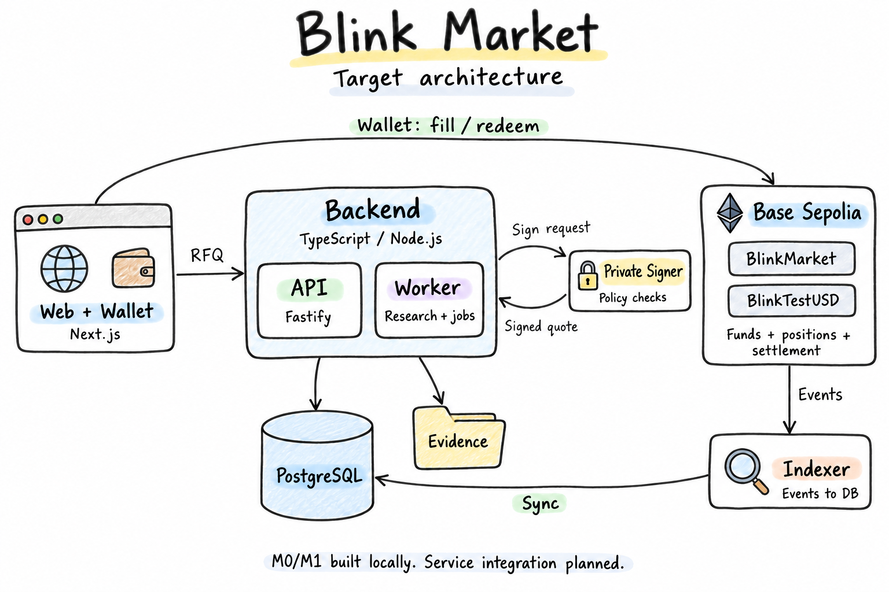

# Blink Market

An experimental platform connecting **prediction research, traceable evidence, and on-chain testnet trading**.

以預測研究為核心，串連可追溯證據與鏈上測試交易的實驗平台。

Blink Market targets Base Sepolia. It starts with questions that have explicit resolution rules, preserves source evidence, collects model and external forecasts, and enables trading in YES/NO shares through signed RFQ quotes. Human-led proposals and a dispute process determine settlement. The goal is to understand not just whether a prediction was right, but also its evidence, cost, reproducibility, and quality over time.

> **Current status:** M0 shared data contracts and foundational components, plus the M1 smart-contract ledger, are implemented and locally verified. Product UI, authentication, research workflows, RFQ services, and service integration remain planned. There is no Sepolia deployment or public trading yet.
>
> 目前完成 M0 基礎元件與 M1 合約帳本的本機實作及驗證；產品與服務尚未整合，未部署 Sepolia，也未開放公開交易。

## Architecture at a Glance · 架構概覽

_Target architecture, not a live deployment. Contracts and foundational components are implemented locally; end-to-end service integration is still planned._

Three responsibilities shape the system:

- **Off-chain research and coordination.** The API receives requests, workers handle research and background jobs, PostgreSQL stores application records, and object storage preserves original evidence and specification bytes.
- **On-chain funds and outcomes.** BlinkMarket validates quotes, maintains full collateralization, records positions, and enforces settlement and redemption. Users retain control of their wallets.
- **Separate signing and synchronization.** A private signer independently checks signing policies. An indexer turns chain events into queryable, rebuildable database projections.

中文摘要：研究與協調在鏈下，資金與最終結果在鏈上；Signer 控制簽署風險，Indexer 同步鏈上資料。圖中服務接線是目標設計，並非已上線功能。

## Scope · 功能範圍

| Area                  | Planned capabilities                                                                                            |
| --------------------- | --------------------------------------------------------------------------------------------------------------- |
| Questions & evidence  | Source allowlists, candidate questions, human approval, frozen specifications, and original evidence snapshots  |
| Prediction research   | Forecast windows, two platform models, external forecasts, an independent baseline, and cost/budget tracking    |
| Quotes & trading      | Single-maker RFQ, EIP-712 signed quotes, YES/NO shares, collateral, and risk reservations                       |
| Resolution & disputes | Human outcome proposals, challenge periods, arbitration, INVALID timeout settlement, and position redemption    |
| Quality measurement   | Brier scores, classification of missing forecasts and invalid outcomes, research costs, and latency             |
| Platform operations   | Identity and permissions, a test-token faucet, audit records, durable jobs, event synchronization, and recovery |

These are business modules within a modular monolith, not separate microservices. The design keeps initial deployment and maintenance costs low while leaving room to split components as load and security needs evolve.

中文摘要：功能分為題目證據、預測研究、報價交易、結算爭議、品質評估與平台營運；以模組區分責任，不為每個功能另建微服務。

## How It Works · 運行方式

The intended end-to-end workflow:

1. **Define a market.** Preserve source evidence, obtain human approval, freeze the specification, and create the market through an administrator's wallet.
2. **Collect forecasts.** Gather predictions within defined windows. Only policy-compliant snapshots from the two fixed platform models inform maker pricing; baseline and external forecasts are evaluated separately.
3. **Request a quote and trade.** A taker requests an RFQ. The service reserves capacity and obtains a signed quote. The taker submits the transaction from their own wallet, and the contract validates it again.
4. **Resolve and redeem.** After market close, a human proposes an outcome, with challenges and arbitration when needed. Once finalized, each position holder redeems independently.
5. **Synchronize and evaluate.** The indexer updates chain-derived projections, while analytics assess prediction quality and cost.

For example, buying **100 YES shares at 6,000 bps** costs the taker 60 bUSD. The maker contributes 40 bUSD, so the contract holds 100 bUSD in collateral. The taker receives 100 YES shares and the maker holds the opposing 100 NO shares. A YES outcome pays the taker 100 bUSD; a NO outcome pays the maker 100 bUSD; INVALID pays each 50 bUSD.

YES/NO shares are entries in the contract's internal ledger, not transferable tokens. Research probabilities, maker quotes, and execution prices are distinct concepts.

中文摘要：題目核准 → 預測 → 簽章報價與成交 → 人工結算與贖回 → 同步及評估。每筆交易由雙方提供完整抵押；YES／NO 是合約內部份數，不是可轉讓代幣。

## Technology & Rationale · 技術選型

| Layer                     | Technology                                                                      | Why it fits                                                                                      |
| ------------------------- | ------------------------------------------------------------------------------- | ------------------------------------------------------------------------------------------------ |
| Web                       | Next.js / React / TypeScript                                                    | Shared data contracts with the API; currently a host scaffold, not a product UI                  |
| Backend                   | Node.js / TypeScript / Fastify                                                  | Suited to RPC, database, and model-API I/O, with less cross-language maintenance                 |
| Application data          | PostgreSQL                                                                      | Transactions, locks, idempotency records, audit trails, a transactional outbox, and durable jobs |
| Evidence & specifications | Original bytes + Keccak-256; local adapter today, S3-compatible storage planned | Verifiable content without hash drift from reserialization                                       |
| On-chain ledger           | Solidity 0.8.30 / OpenZeppelin / Base Sepolia                                   | Integer accounting and fixed collateral/settlement rules in non-upgradeable contracts            |
| Chain interaction         | viem / EIP-712                                                                  | Typed contract calls, structured quote signatures, and deployment verification                   |
| Verification              | Foundry / Anvil / Node test / PGlite                                            | Contract fuzzing, multi-user invariants, local replay, and PostgreSQL-semantics regression tests |
| Repository structure      | pnpm workspace / layered packages                                               | Shared contracts with explicit dependencies between domain, application, ports, and adapters     |

The backend is a **modular monolith with separate processes by responsibility**. Web, API, Worker, Indexer, and Signer belong to one codebase, with shared domain definitions but distinct workloads and trust boundaries. This balances development effort, reliability, and early operating costs; it does not assume a language-level throughput advantage without benchmarks.

中文摘要：以 TypeScript 共用契約、PostgreSQL 保護鏈下交易一致性、Solidity 固定資金規則。按責任拆程序，在開發難度、穩定性與初期成本之間取得平衡。

## Design Boundaries · 設計邊界

- **Testnet and test assets only.** BlinkTestUSD is a six-decimal test token, bUSD. Mainnet trading is out of scope.
- **Models hold neither keys nor adjudication authority.** Their outputs are research or recommendations. Market creation, proposals, challenges, and arbitration have explicit roles.
- **A quote is not a trade.** A database reservation is not an on-chain lock. Execution still depends on contract checks for balances, deadlines, caps, and signatures.
- **The chain is the source of truth for funds.** Database projections can be rebuilt. RPC timeouts or unknown transaction states do not justify blindly treating an operation as failed and resubmitting it.
- **Pausing new trades does not freeze existing positions.** Settlement and redemption continue under the contract's rules.
- **LIVE and REPLAY stay separate.** Prospective real-world events and test replays are evaluated separately. Passing tests is not a security audit.

中文摘要：僅限測試網；模型不能掌握私鑰或裁決；報價不保證成交；資金以鏈上帳本為準。交易暫停不阻擋既有部位依規則結算與贖回。

## Project Status · 目前進度

| Milestone                                                                                        | Status                                                              |
| ------------------------------------------------------------------------------------------------ | ------------------------------------------------------------------- |
| M0 — Data/API contracts, deployment verification, database and specification-archive foundations | Implemented and locally verified; not wired into business handlers  |
| M1 — Test token, collateralized trading ledger, settlement/redemption, and multi-user tests      | Implemented and locally verified; not deployed to an external chain |
| M2 / M3 / M4 — Identity, business data, research workflows, RFQ, Indexer, Signer, and product UI | Implementation and integration planned                              |

中文摘要：M0／M1 已完成本機驗證；M2–M4 為後續業務與產品整合。本專案尚未進入公開測試階段。

## Further Reading · 延伸閱讀

Detailed project documents are currently primarily in Traditional Chinese.

- [Architecture walkthrough · 架構圖解](docs/ARCHITECTURE_GUIDE.md) — Five diagrams covering implementation status, service responsibilities, trading, settlement, and recovery.
- [Architecture · 整體架構](docs/ARCHITECTURE.md) · [Data model · 資料模型](docs/DATA_MODEL.md) · [Detailed design · 細部設計](docs/design/README.md).
- [Delivery & verification · 交付與驗證](docs/M0_M1_DELIVERY.md) · [Roadmap · 實作進度](docs/ROADMAP.md) · [Architecture decisions · 技術決策](docs/adr/0001-platform.md).
- [Development guide · 開發指南](docs/DEVELOPMENT.md) · [Operations · 運行與部署](docs/OPERATIONS.md) · [Domain terminology · 領域用語](CONTEXT.md).
- [Original MVP specification · 原始規格](Blink_MVP_v0.1_Base_Sepolia_Spec.md).
