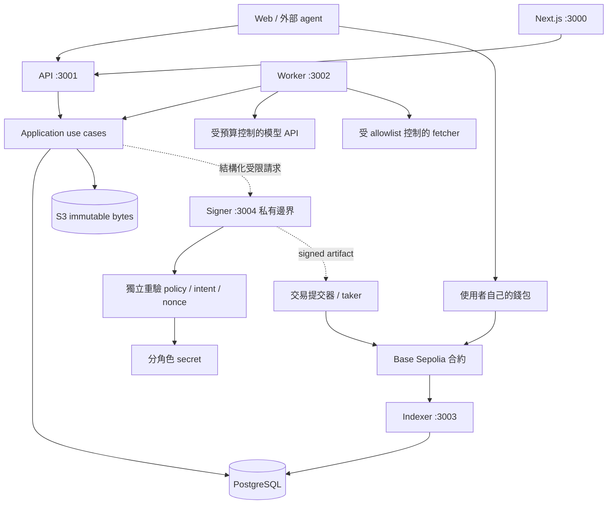
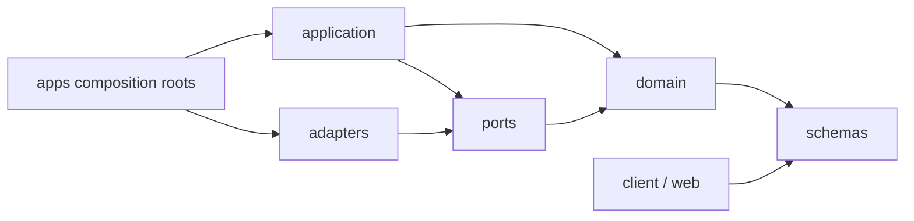

# 整體架構

圖解導覽：[架構圖解與運行方式](ARCHITECTURE_GUIDE.md)，先看目前已實作範圍，再看完整系統與運行流程。

細部介面與交易順序見 [細部設計](design/README.md)；決策以 [ADR 0002](adr/0002-protocol-boundaries.md) 為準。M0資料契約與M1合約已實作；下圖的API/worker/indexer/signer整合仍是目標架構，當前狀態見 [交付記錄](M0_M1_DELIVERY.md)。

## 決策摘要

採用 **TypeScript + Node.js 的模組化單體，按風險與工作型態拆程序**。API 使用 Fastify；Web 使用 Next.js / React；PostgreSQL 負責業務資料、transactional outbox 與持久工作；S3 相容儲存為正式快照儲存目標；Solidity + Foundry 實作鏈上帳本。M0/M1 已鎖定 viem 2.56.8，並用於spec hash、部署驗證與本機REPLAY。

這個選擇平衡目前最多 5 個 LIVE 市場、单 maker、小團隊與 I/O 為主的負載。沒有壓測數據前，不聲稱 TypeScript 比 Go/Rust 快；它的價值是資料契約共用、較少跨語言維護與足夠的初期吞吐。合約內金額由 EVM 整數處理。

## 系統與信任邊界

此圖表示目標整合架構；M0/M1已有本機帳本與基礎adapters，但host尚未接業務handler，虛線通路尚未實作。Signer不接公網、不對LLM開放的權限隔離需在M2/M3接線驗收。PostgreSQL共用實例不代表共用DB credential。

## 程序分工

| 程序 | 工作 | 擴展／部署策略 |
| --- | --- | --- |
| Web | 公開研究、證據、預測、交易與管理 UI | 獨立部署，透過 API，無 DB／signer secrets |
| API | 認證、驗證、讀取、同步 RFQ 與 command 接收 | 無狀態，多 instance 前先共用限流與 DB reservation |
| Worker | discovery、forecast、成本對帳、keeper 排程 | 同一 codebase 的 job registry，按 job type/併發限額擴展 |
| Indexer | event 拉取、reorg、projection、重啟 reconciliation | 每 deployment 單一 lease owner，擴容按 deployment 分片 |
| Signer | maker quote、內部 trader、faucet、keeper 的受限簽署 | 私有程序；目標每角色獨立 identity / key / nonce 鎖 |
| 合約 | 抵押、成交、持倉、最終結果與贖回 | 非升級；新版本新部署，不可改舊市場規則 |

初期 Web/API/Worker/Indexer 可共用一台小型應用主機；Signer 至少獨立程序與 OS/container 身份。正式 Alpha 必須再落实網路 ACL、獨立 secrets、caller 身份與每角色函式 allowlist；只分資料夾不形成安全隔離。手動管理與裁決錢包不放自動 signer。

## 功能模組與 ownership

| 模組 | 功能 | 核心資料／介面 |
| --- | --- | --- |
| identity | operator、agent、邀請 key、scope、wallet binding | api_keys、wallet_challenges |
| evidence | 來源 allowlist、擷取、快照、hash、公開權限 | SourceFetcher、ImmutableObjectStore |
| discovery | 每日掃描、結構化候選、revision、檢查 | candidates、candidate_revisions |
| markets | 人工核准、凍結規格、部署 intent、題目讀取 | MarketSpec、markets |
| forecasts | DAILY/PRE_CLOSE、內部兩模型、baseline、外部預測 | windows、forecasts、model_runs |
| budgets | 問題／每日成本、預留、實際／未知用量 | cost_entries、UnitOfWork |
| trading | RFQ、簡單平均價格、預留、mandate、quote 生命週期 | quotes、collateral/risk reservations |
| chain | 交易狀態、nonce/replacement、events、reorg、持倉投影 | ChainReader、transactions、cursors |
| resolution | 結果建議、auditor 工單、人工核對、keeper | reports、鏈上 outcome |
| faucet | 邀請地址 mint、24h 額度、獨立 gas 預算 | claims、受限 mint intent |
| analytics | Brier、缺失/INVALID、成本、延遲、外部採用 | 可重建 score/read models |
| operations | jobs/outbox、idempotency、audit、告警與恢復 | 跨模組基礎设施 |

管理頁不是第十三套領域邏輯：它呼叫相同模組的管理 use cases。Quote service 初期是 trading application module，無獨立微服務。每個 forecaster 是 job 類型／模型設定，不是獨立服務。

## 程式依賴

- schemas：JSON wire contract，不依賴框架、DB 或 Node 特定 API。
- domain：領域狀態與不變量，不能 import Fastify、Next、SQL 或 RPC client。
- application：use case、跨模組協調、transaction 邊界；依賴 ports，不依賴 adapters。
- adapters：PostgreSQL、viem、模型 provider、物件儲存的具體實作。
- apps：注入實作、註冊 transport、管理程序生命週期，避免放業務規則。
- runtime：最小 HTTP bootstrap；不演變成任意工具的共用資料夾。
- client：對外契約與範例，不引用後端內部資料模型。

`pnpm check:boundaries` 檢查 package dependency / 靜態 import 的基本方向；它不是私鑰隔離或完整 static analysis。M2.1 僅將 identity application／PostgreSQL adapter 接入可選的 API identity 模式，其他業務仍不回假成功。詳見 [身份交付](M2_IDENTITY_DELIVERY.md)。

## 關鍵資料流

### 候選 → 市場

allowlist 擷取 → 保存 bytes/hash → candidate revision → validation → 人工核准。核准 use case 在同一 DB transaction 寫 approval、spec record、deployment intent、audit 與 outbox。物件儲存先 put-if-absent，再提交 DB 引用；失敗留下可清理的孤立物件，不提供未保存 bytes 的規格。

建市由 ADMIN 人工錢包簽署；worker 追蹤該 intent 與 tx。APPROVED → DEPLOY_PENDING → 索引到 canonical MarketCreated 才 DEPLOYED。重試先查 specHash、nonce 與 receipt，不新增市場。

### 預測 → RFQ → 成交

window 開放 → 原子研究預算預留 → 模型／外部提交 → 截止後公開 → 合格固定雙模型平均。Baseline 分開，缺一模型時 ensemble 缺失；maker 沒有合格 snapshot 即拒絕報價。

RFQ 驗證身份／wallet／deployment／市場與 freshness → DB lock 下 maker collateral reservation → signer 重驗 → 回 EIP-712 quote。鏈上資金尚未鎖定；quote service 不替代合約驗證。外部 taker 本人 approve 與 fill；內部 trader 另受 notional/gas mandate。

Index canonical QuoteFilled → 同一 cursor 對帳 consumed、balance、reservation 與 position projection。簽署成功但回覆遺失也保留 reservation；到期不單憑本機時間釋放。

### 結算 → 品質

parser 建議 → RESULT_PROPOSER 人工核對提案 → CHALLENGER 可挑戰 → ARBITER 人工裁決／permissionless finalize → 鏈上 FINAL → 本人 redeem。hardDeadline 後只能 INVALID，暫停與撤銷交易資格不阻擋贖回。Keeper 不擁有裁決權。

analytics 只以相同 event/horizon 的 LIVE YES/NO 算 Brier；INVALID、REPLAY、缺失與污染分列，不以窗口數增加獨立事件樣本。

## 故障與一致性

- PostgreSQL 是鏈下 append-only 記錄來源；合約帳本與結果以 canonical chain 為準。
- 所有寫入 use case 有 operator + endpoint + idempotency key，payload hash 不同回 409。
- Outbox 與业务異動同 transaction；queue 至少一次交付，handler 必須冪等，不宣稱 exactly-once。
- Worker lease 有到期／重試／dead-letter 與人工重放；不可無限重試付費模型或經濟操作。
- API 202 只表示接受 intent；UNKNOWN 不釋放風險，不用新 nonce 盲目重送。
- Indexer 落後 >3 blocks 或 >10 秒無更新，任一成立即停止 RFQ 與內部 trader。
- 保存 block/parent hash、reorg tombstone，回共同祖先撤回投影再重放；finalized tag 不支援時標 unknown。
- 暫停只阻止新增交易；proposal/challenge/finalize/redeem 與 free collateral 提領保留合約規則。
- UTC 全程使用明確時區；微單位／uint256 wire 用 decimal string、SQL NUMERIC、運算用 bigint。機率可用 [0,1] 有限 decimal，不拿 float 算資金。
- 不重複 serialize spec 做 hash 驗證；原始 bytes 要能下載。

## 頁面分類（尚未實作 UI）

公開：市場列表、問題詳情（證據／預測／baseline／成本）、結算詳情、agent 接入。
錢包：測試交易、持倉／贖回。管理：候選核准、工作失敗、預算、pause、結果與爭議工單。

研究機率、maker ask、實際成交價分開；LIVE/REPLAY 與測試資產標籤永久顯示。Web host 現在只輸出功能清單 JSON，沒有假市場、假報價或可點擊的假交易按鈕。
