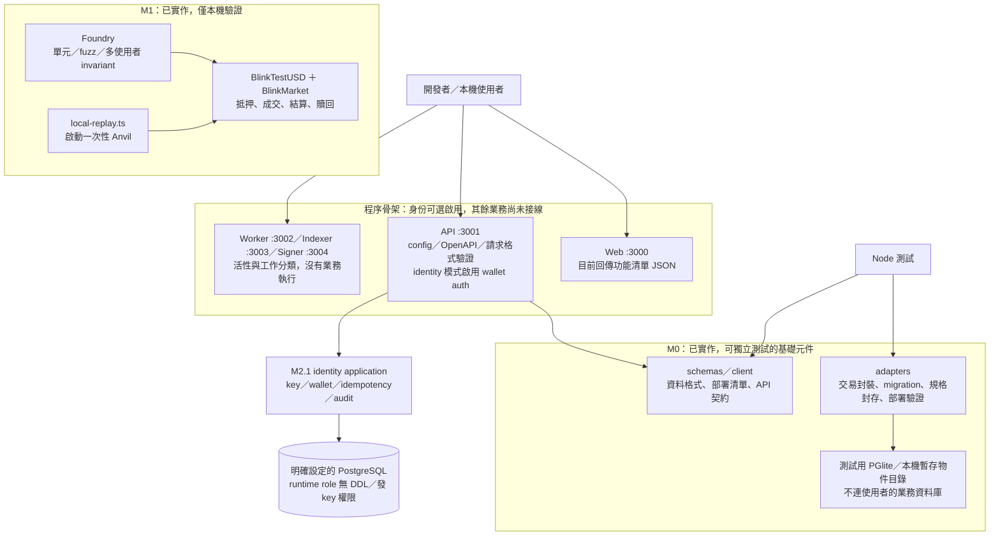
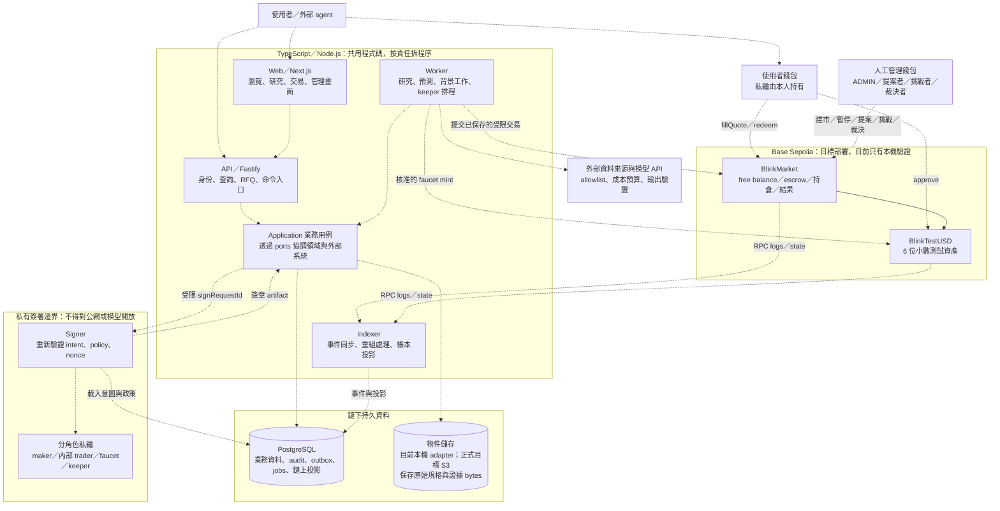
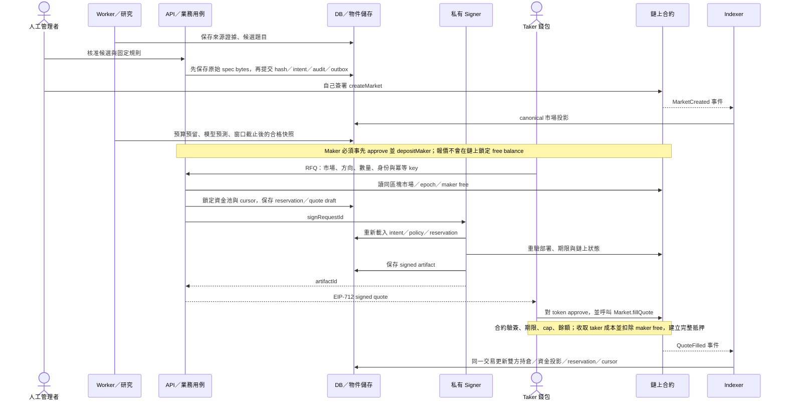
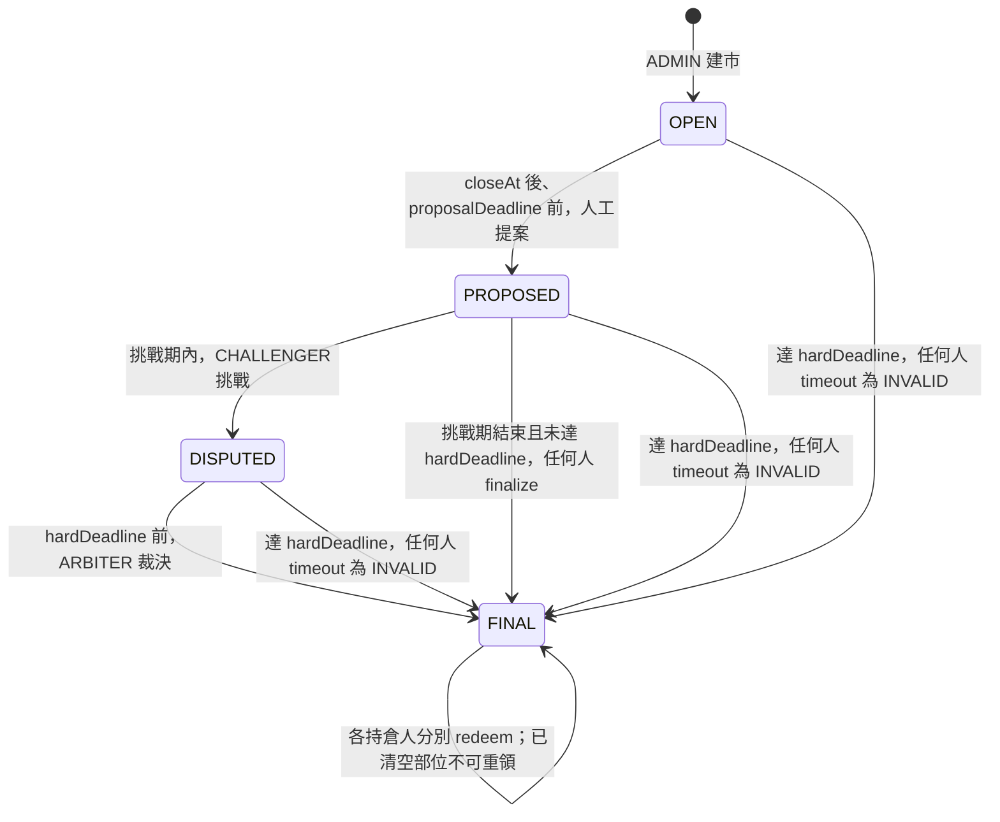
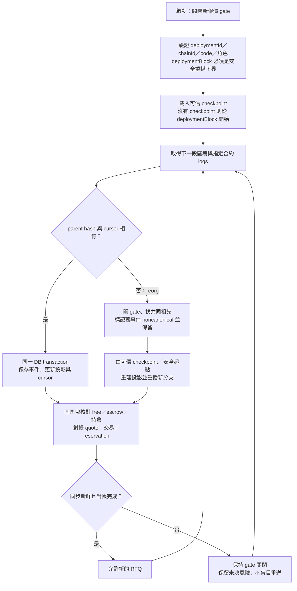

# 架構圖解與運行方式

先記住一句話：**鏈下系統負責研究、報價與工作協調；鏈上合約負責資金、持倉及最終結果。** 網頁不是帳本，資料庫也不能修改鏈上的持倉。

以下使用 Mermaid 圖，支援 Mermaid 的 Markdown 預覽器可直接顯示。技術細節見 [架構設計](ARCHITECTURE.md)、[細部設計](design/README.md)。

## 1. 現在已經做到哪裡？

M2 最新範圍見 [人工核准](M2_APPROVAL_DELIVERY.md#flow) 與 [建市觀測](M2_CREATION_TRACKING.md#flow-and-states)：證據與候選 → 核准／容量鎖 → 未簽署意圖 → 管理員自行送出 → 操作員觸發 receipt 驗證與確認數／reorg 觀測。錢包 UI 與持續 Indexer 尚未接線。

這張圖只畫**目前真的存在的能力**。實線代表已存在的呼叫或驗證路徑，不代表已對外部署。

Web 現在還不會呼叫 API 完成交易。API、Worker、Indexer、Signer 的 readiness 都不代表業務就緒；沒有正式部署地址、持續同步或自動簽章。M0 元件可用，但尚未串成線上產品。

身份流程與啟用方式見 [M2.1 交付](M2_IDENTITY_DELIVERY.md)。預設仍是 scaffold，不會因存在共用 DATABASE_URL 就自行連接業務資料庫。

## 2. 完整系統將如何分工？

以下是**目標架構**。所有虛線都是後續 M2/M3 要接的業務路徑；實線僅表示兩份已實作合約之間的 token 呼叫。Signer 私有隔離是部署要求，尚未落實為可用服務。

### 功能模組不是十二個微服務

| 功能分類   | 領域模組                     | 負責什麼                                 |
| ---------- | ---------------------------- | ---------------------------------------- |
| 接入與管理 | identity、operations         | 身份、權限、audit、冪等、工作與故障恢復  |
| 研究與建市 | evidence、discovery、markets | 來源、快照、候選、人工核准、凍結規格     |
| 預測與成本 | forecasts、budgets           | 預測窗口、模型／外部預測、預算及實際成本 |
| 交易與資產 | trading、chain、faucet       | RFQ、風險預留、交易追蹤、測試幣領取      |
| 結算與評估 | resolution、analytics        | 結果建議、爭議工單、績效與品質統計       |

它們共用同一套 domain/application 程式碼，依工作型態放在 API 或 Worker；不需要替每個模組維護一套部署。Indexer 專門同步鏈，Signer 專門控制簽署風險。

程式依賴方向：`apps → application → ports/domain → schemas`，`adapters` 實作 `ports`。業務邏輯不直接依赖 Fastify、SQL 或 RPC；見 [完整依賴圖](ARCHITECTURE.md#程式依賴)。

## 3. 從題目到成交：錢何時真正移動？

以下是**目標端到端流程**；規格封存元件與合約已實作，其餘協調路徑尚未接線。

例：買入 **100 YES、價格 6000 bps**，taker 付 60 bUSD，maker 的 free balance 扣 40 bUSD，市場 escrow 增加 100 bUSD；taker 取得 100 YES，maker 取得 100 NO。這些份數是 `BlinkMarket` 內部帳本，不是可轉讓的 YES/NO ERC-20。

DB reservation 防止服務重複承諾額度，但不能保證 quote 一定成交。鏈上執行時仍可能因過期、cap、提款、取消或 epoch 改變而拒絕；以合約執行結果為準。

## 4. 到期後，誰決定結果？

這張圖對應**已實作的合約狀態機**。研究模型只能提出建議，沒有裁決權。

| 最終結果 | 每份 YES |  每份 NO |
| -------- | -------: | -------: |
| YES      |   1 bUSD |        0 |
| NO       |        0 |   1 bUSD |
| INVALID  | 0.5 bUSD | 0.5 bUSD |

LIVE 挑戰期為 86400 秒，REPLAY 為 120 秒。`closeAt` 到後不能再成交；即使交易暫停或 taker 被取消交易資格，既有持倉仍可依規則結算、贖回。Maker 贖回所得回到錢包，不自動成為新的 free balance。

## 5. 為什麼需要 Indexer？故障後如何恢復？

以下是**後續要實作的同步流程**。鏈是資金與結果的真相來源；DB 的投影讓 API 快速查詢，也可在事故後重建。

最新 head 落後超過 3 blocks，**或**超過 10 秒未成功更新，任一成立就停止新報價。簽署或送交易逾時不等於失敗；到期也不能只看本機時鐘就釋放 reservation。跨越已 finalized checkpoint 的矛盾要停下來人工調查。

此次修正保護了三個基礎環節：

- DB 的 `COMMIT` 若實際回覆 `ROLLBACK`，用例必須失敗，不能回報成功。
- 本機物件先寫完整暫存檔，再原子發布 hash 路徑；並行操作不會讀到發布中的半份內容。
- 部署驗證會檢查 `deploymentBlock - 1` 時兩份合約均尚無 code，避免未來從過晚的起點漏同步事件。

## 建議閱讀順序

先看本頁第 1、2 圖掌握現況與目標，再看第 3、4 圖理解交易與結算；要實作下一階段時，再讀 [工作包](design/06-work-packages.md) 與 [恢復細節](design/04-execution-recovery.md)。
