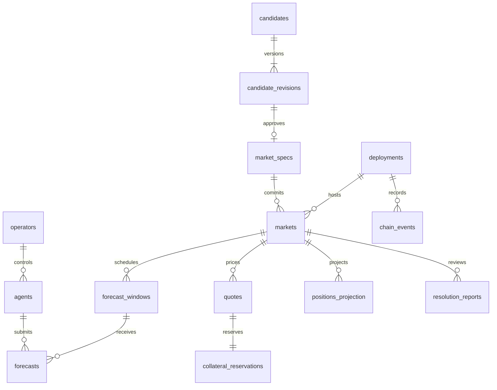

# 資料模型設計

最新增量：`0005_creation_tracking` 已實作 `chain.creation_projections` 與 `chain.creation_observations`，用於版本化的單筆建市事件觀測；其餘 blocks/events/global cursor 與持倉表仍待實作。詳見 [M2.3a](M2_CREATION_TRACKING.md)。

這是 M2 的完整邏輯模型。0001 為 operations 基礎；0002 為 identity；0003 為 evidence/discovery；0004 已新增 markets.deployments/deployment_checks/specs/approvals/creation_intents/active_slots。最新交易邊界見 [核准交付](M2_APPROVAL_DELIVERY.md)。鏈上事件、slot 釋放及其餘业务表仍待實作；下表其餘名稱是邏輯藍圖，不代表已存在 SQL 表。

## 模組與資料表

| Owner | Tables | 主要欄位與約束 |
| --- | --- | --- |
| identity | operators, agents, api_keys | agent.operator_id FK；key_hash 唯一、scopes、revoked_at、expires_at；無明文 key |
| identity | wallet_challenges, wallet_bindings | nonce hash 唯一、domain/chain/expires_at/consumed_at；binding 經簽章驗證 |
| evidence | source_allowlists, evidence | URL、published/observed_at、content_hash、object_uri、access_policy；不可覆寫原始快照 |
| discovery | candidates, candidate_revisions | candidate + revision 唯一、creator、state、canonical_key；append-only revision |
| markets | market_specs | spec_hash 唯一、raw_bytes_uri、schema_version、approval actor/time、canonical_key |
| markets | markets | UNIQUE(deployment_id, chain_market_id)、mode、spec FK、times、狀態 projection |
| forecasts | forecast_windows | UNIQUE(market_id, horizon_type, scheduled_at)、open_at、deadline |
| forecasts | forecasts | UNIQUE(window_id, agent_id)，即使撤回也不刪除；NUMERIC probability CHECK 0..1、received_at |
| forecasts | model_runs | model/prompt hash、sampling/tool version、input hash、cutoff、baseline/platform/external |
| budgets | question_budgets, daily_budgets | USD micros caps、reserved/spent/unknown；daily date 固定 UTC |
| budgets | cost_entries | reserve/reconcile 事件、provider request ID、預估／實際／未知成本；append-only |
| trading | rfqs, quotes | rfq taker/market/max_cost、digest 唯一、payload、signature、expiry、epoch |
| trading | collateral_reservations | quote/draft intent FK、maker_cost、state、reconciled block hash |
| trading | mandates, risk_reservations | agent、daily/open notional、gas cap、economic intent、pending 占用 |
| chain | deployments | deployment_id、84532、addresses、deployment block、ABI/bytecode hashes、角色、版本 |
| chain | chain_transactions | action_id、sender、nonce、hash、replacement_of、status；同 nonce 可多 hash，不錯設唯一 |
| chain | chain_blocks, chain_cursors | block hash、parent hash、number、canonical、finalized capability、deployment cursor |
| chain | chain_events | UNIQUE(deployment_id, block_hash, tx_hash, log_index)，canonical flag/tombstone |
| chain | positions_projection | UNIQUE(deployment_id, market_id, address)、yes/no、as_of_block_hash |
| resolution | resolution_reports, resolution_actions | author、evidence、suggested outcome、operator、intent、canonical chain ref |
| faucet | faucet_claims | verified address、claimed_at、amount、economic intent、pending status |
| analytics | evaluation_runs, score_entries | mode、event/horizon、input versions、missing/invalid/contaminated flags |
| operations | idempotency_records | UNIQUE(operator_id, endpoint, key)、payload_hash、response/intent ref |
| operations | audit_log | actor、action、resource、reason、request_id、before/after hash、UTC |
| operations | jobs, outbox | dedupe_key、type、attempt、next_run_at、lease_until、lease_owner、last_error |

## 關聯

## 必須寫入 migration 的約束

- 鏈上 market ID 不可單獨當全域 key；所有鏈資料帶 deploymentId。依 [ADR 0002](adr/0002-protocol-boundaries.md)，API 的 /markets/:id 使用鏈上十進位 marketId，另要求 deploymentId query；DB UUID 稱 marketRecordId，只供內部 FK。這取代前版 opaque path ID 的設計，尚待 schema/API 實作。
- UInt 欄位使用 blink.uint256 domain：NUMERIC 加 CHECK 0 <= value < 2^256 且 value=trunc(value)，避免 NUMERIC(78,0) 先把小數四捨五入。uint64/caps 依合約限制更小。
- 所有業務時間 TIMESTAMPTZ；保存 UTC，chain timestamp 另用 NUMERIC decimal seconds。
- 題目去重需要交易鎖：相同 canonical key ACTIVE 不重複，LIVE 同公司季度最多一交易市場；REPLAY 使用不同 ID 並隔離 mode。5 個 LIVE 上限的檢查與核准在同一 lock 邊界。
- Forecast unique 不因撤回失效；withdrawn_at 保留、原文不改，窗口過期拒絕補交。
- Chain event identity 加 block hash，允許 orphaned tx 後來在另一 block 重納；canonical projection 使用 canonical 事件，不能把 tombstone 當永久 consumed。
- 不對 sender+nonce 設唯一；replacementOf 串歷史，另 active intent/nonce allocation 以 lock 控制。
- 每地址 faucet 24 小時是 rolling window，不是按 UTC calendar day；同地址 transaction lock + pending reservation 防並發領取。
- Audit、revision、forecast、cost ledger append-only。服務 DB role 不授 UPDATE/DELETE；withdrawal/annotation 放附加事件。Chain canonical flag / projection 是可修改且可重建資料。
- Evidence 有無全文轉載權與原始物件存取分離；公開 API 經 access_policy 過濾，object bucket 不設 public。
- 引用 evidence 可用 join table，不在可查詢關聯上大量使用 JSONB；原始模型 payload、quote payload 才保留 JSONB 與 schema version。

## 原子交易

1. 核准：鎖 candidate revision / active key / LIVE capacity → 寫 approval + spec ref + intent + audit + outbox。
2. 模型：固定 lock order 先 daily budget 再 question budget → 最壞預估成本 reservation → commit → 外部 request。費用未知保留占用。
3. 報價：鎖 maker deployment reservation pool → 檢查同 cursor free balance / staleness → reservation + quote draft → commit → 受限簽章。簽章 timeout 留 UNKNOWN，不能直接釋放。
4. 索引：deployment lease → canonical block/events + projection + cursor 同 transaction；reservation 的解除以同一區塊 consumed / balance 查詢驗證。
5. Idempotency：插入 scope key + payload hash → 唯一衝突回原 response，payload 不同 409；in-flight 回可重試狀態，不能重做副作用。

金額上限／預算決策不可用 SKIP LOCKED 略過被鎖資金列。SKIP LOCKED 只用於 job 領取；handler 執行外部 IO 不持有長 DB transaction。

## 復原

每天 backup + object manifest；Alpha 前在空 DB 還原業務記錄、從 deployment block 重播 canonical events、重建 positions，逐市場核對 escrow/free balance/consumed。REORGED、UNKNOWN 與未決 reservation 未 reconcile 前不恢復 RFQ。
