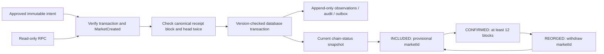

# M2.3a — MarketCreated receipt reconciliation

This slice connects an approved creation intent to a **real RPC-observed transaction, MarketCreated event and chain-assigned market ID**. It is an operator-invoked, read-only chain observer, not a continuously running indexer. The implementation is tested with mock RPC fixtures and actual receipts from isolated local Anvil contracts; no remote transaction was sent and no public deployment was created.

中文摘要：建市意圖可以接收鏈上觀測結果，確認事件與交易一致後顯示 marketId。這階段是單筆交易追蹤工具，不是完整 Indexer，也不會簽署或廣播。

## Flow and states



| State | Meaning |
| --- | --- |
| NOT_TRACKED | No validated transaction has been recorded |
| UNKNOWN | A matching transaction was seen, but a usable receipt is currently unavailable; no current marketId |
| INCLUDED | Successful canonical receipt and exact event; fewer than 12 confirmations |
| CONFIRMED | Same checks, with at least 12 confirmations at the recorded head |
| REVERTED | A matching transaction has a canonical reverted receipt; no marketId |
| REORGED | Its previously observed block is no longer canonical; no current marketId |

Twelve confirmations are this slice's fixed observation policy, **not Base L1 finality**. Every response includes head hash/number, receipt block hash/number, observation time, confirmation count and projection version. This is an as-of snapshot, not a guarantee that the chain has not changed since. INCLUDED market IDs are provisional; CONFIRMED can also be withdrawn after a reorg.

## Validation and failure behavior

- Require chain 84532 and consistency between the stored deployment, target contract and admin sender.
- Compare the actual transaction hash, sender, target, zero native value and complete calldata against the immutable intent.
- Require the receipt and transaction to agree on their block, verify the block against the canonical chain and verify the contract bytecode hash at the receipt block.
- Decode exactly one MarketCreated event from the intended contract. Re-encode its full parameters and compare to the intended calldata, including spec hash/URI, mode, deadlines, challenge duration and caps. The market ID must be positive and stays a decimal string, including above JavaScript's safe integer limit.
- Re-read both receipt-block and head anchors after verification. A mid-read reorg aborts without a database write.
- A missing receipt is not a revert. Previously observed block anchors are retained so a later reorg can be proved. RPC errors do not overwrite the last observation or release capacity.
- A head behind the previous observation or behind a new receipt is treated as an inconsistent/lagging RPC snapshot; retry later, rather than declaring a reorg from height alone.
- Re-inclusion of the **same transaction hash** may have a different block or market ID; the new observation supersedes the projection while history remains intact.

## Persistence and permissions

Migration `0005_creation_tracking.sql` adds `chain.creation_projections` and append-only `chain.creation_observations`. PostgreSQL grants projection writes only to the indexer group, not to API/worker/signer roles. The CLI requires a non-owner indexer login without API/admin-group membership.

RPC IO happens outside a database transaction. On save, the observer rechecks deployment enablement, locks the projection and compares the version loaded before RPC IO. A stale concurrent result fails with `STALE_CREATION_OBSERVATION`; it cannot overwrite a newer snapshot. Each accepted observation increments the version. Observation, projection, and any state/block/market change's audit and outbox event commit atomically. Outbox type `market.creation_observed` is a notification, not a signing command.

Unique deployment/market IDs prevent two creation intents from simultaneously owning the same projected market. If an older stale projection conflicts after a reorg, reconcile that older intent first. No creation intent, candidate approval history or active slot is deleted/mutated by this observer. A candidate's `DEPLOY_PENDING` history records its approval-stage state; current chain status is exposed separately so a reorg does not rewrite history.

## Operation and API

Apply migration 0005 with the migration account. Supply `INDEXER_DATABASE_URL` using a separate login in `blink_indexer`, plus an operator-selected `BASE_SEPOLIA_RPC_URL`:

```sh
pnpm creation:reconcile <creation-intent-uuid> <transaction-hash>
```

Run again for later confirmations or reorg checks. The bundled entry is `dist/tools/reconcile-creation.mjs`. It only uses RPC read methods and database observation writes; it accepts no private key and never sends a transaction. The existing `apps/indexer` process remains a scaffold; **nothing polls automatically** in this slice.

In API approval mode, `GET /v1/admin/creation-intents/:id/chain-status` returns the stored snapshot (admin scope, `no-store`). The client helper is `getCreationChainStatus`. Querying this endpoint does not trigger RPC IO or refresh the snapshot. The original unsigned-intent endpoint is unchanged. API approval startup now requires migration 0005.

The first trackable transaction must exist and match the intent; an entirely unknown hash cannot create a tracking record. Once recorded, this slice pins that hash. Replacement/cancel transactions are intentionally not accepted as a silent change of identity; they require a later explicit workflow.

## Verification and remaining scope

Local verification on 2026-10-07: `pnpm check` passed with 37 Node tests, type/boundary checks and Solidity compilation. All 24 contract tests, both extra invariant seeds, Web build, service bundle build, both bundle tests and OpenAPI generation passed. The three isolated Anvil replay scenarios additionally validate this receipt reader against actual MarketCreated logs (IDs 1, 2 and 3). The initial sandboxed replay was blocked from opening localhost; its approved local-only rerun passed.

Tests cover inclusion, the 12-block threshold, IDs above 2^53, reorg withdrawal and same-hash re-inclusion, wrong chain/sender/target/value/calldata/event/code, missing/reverted receipts, RPC failures, changing block anchors, regressed heads, API permissions, immutable history, stale-writer rejection and audit-failure rollback. The real PostgreSQL suite also races two independent indexer sessions against the same projection version; only one observation/outbox event may commit. RPC in these tests is a deterministic fixture, not an actual network.

Not included: continuous block-range scanning, a global canonical cursor/common-ancestor rollback engine, all-market public queries, position/resolution projections, L1 finality proofs, replacement/cancel tracking, candidate DEPLOYED projection, or capacity release. Trading readiness remains false. Pending slots remain reserved even after revert/reorg/unknown because other delayed transactions may exist; do not delete them manually. These are prerequisites for later full-indexer and RFQ work, not features this slice claims to complete.
