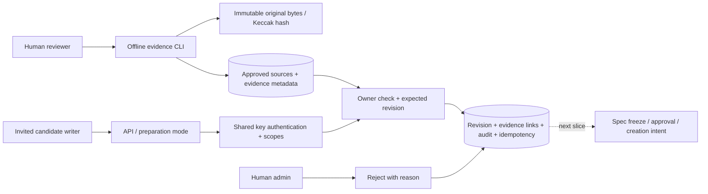

# M2.2a — Evidence and candidate preparation

**Follow-up:** Human approval and unsigned creation intents are now available in a separate opt-in approval mode; see [M2 approval delivery](M2_APPROVAL_DELIVERY.md). This document records the earlier preparation-only slice.

Implemented locally; not a complete M2 delivery. This slice follows the identity foundation and stops **before approval, deployment registration, market-creation intents or chain submission**. Those routes remain disabled rather than returning a pretend market or transaction.

中文摘要：目前完成證據封存／權限與候選版本流程；規格核准、建市意圖及鏈上整合仍未完成。

## Data flow and boundaries



There is no network fetching in the importer. A reviewer approves an exact HTTPS source URL and company identity, then imports a local file. This is a provenance workflow, not cryptographic proof that the file came from that URL. Official-source review remains a human responsibility. Automated allowlist fetching belongs to M3.

The original bytes are written and read back with hash verification before the SQL transaction. A failed import may leave an unreferenced immutable object; it cannot commit a reference before successful archive verification. Back up the object directory and database together. API processes need no filesystem access to original evidence.

## Available operations

| Operation | Behavior |
| --- | --- |
| `POST /v1/candidates` | `candidate:write`; create a private draft at revision 1 |
| `GET /v1/candidates/:id` | Owner operator or admin; includes immutable history |
| `POST /v1/candidates/:id/revisions` | Owner with write scope; requires `expectedRevision`; appends a draft |
| `POST /v1/admin/candidates/:id/reject` | Admin scope; append rejected revision and audit reason |
| `GET /v1/evidence/:id` | PUBLIC/EXCERPT metadata public; PRIVATE owner/admin only |

All writes use persistent idempotency; cached responses still require a valid, non-revoked key. Evidence IDs are unique and canonicalized. Evidence must match the candidate company and have an enabled source. Private evidence cannot be borrowed by another operator. Missing and unauthorized resources both return 404. Every response is `no-store`; no object URI appears in evidence responses.

Candidate row locks and expected revisions prevent lost updates. Source row locks keep policy stable while a candidate is written. Revisions, evidence records and evidence links reject updates/deletes/truncation. Audit failure rolls back candidate, history and idempotency writes together. Rejection creates a new revision; the owner may submit a later draft. Approved/pending/deployed states cannot be edited by this service, and this slice cannot enter those states.

## Configuration and operations

Run all migrations using a separate migration account. `0003_preparation.sql` adds the evidence/discovery schemas and `blink_evidence_admin` NOLOGIN group. Assign separate login credentials; never give the API an owner, superuser, identity-admin or evidence-admin account.

- `BLINK_API_MODE=preparation` enables identity plus these five preparation routes.
- `API_DATABASE_URL` and `WALLET_BINDING_ORIGIN` are required, as in identity mode.
- The offline CLI alone receives `EVIDENCE_ADMIN_DATABASE_URL` and `EVIDENCE_OBJECT_DIRECTORY`.
- `scaffold` remains the default; `identity` continues to enable only wallet binding.

Example commands (environment values are injected separately):

```sh
pnpm evidence:admin allow-source --entity ACME --url https://ir.example.test/quarter --reason 'Reviewed replay fixture'
pnpm evidence:admin import --metadata ./reviewed-metadata.json --file ./original-release.txt
```

The metadata file contains `sourceId`, owning `operatorId`, nullable ISO `publishedAt`, `accessPolicy`, nullable `excerpt`, and audit `reason`. EXCERPT requires reviewed text; original files must be 1 byte–10 MiB. A future publication time is rejected by the database. No URL is fetched by either command. Repeated CLI imports intentionally create separate evidence records; original bytes deduplicate by hash.

Client helpers: `createCandidate`, `reviseCandidate`, `rejectCandidate`, `getCandidate`, `getEvidence`. The service bundle includes `dist/tools/evidence-admin.mjs`; it is not part of the API runtime image.

## Verification and remaining work

Local verification on 2026-10-02: `pnpm check` passed (type checks, 25 Node tests, package boundaries and Solidity compilation); all 24 Foundry tests passed; service bundles built and both isolated-bundle tests passed; OpenAPI generation and `git diff --check` passed.

The PGlite/API suite covers privacy, source/company checks, revoked source policy, revision conflict, immutable history, admin-only rejection, transactional rollback, revoked-key replay and 90 seeded operations across three independent owners. PGlite serializes its single connection; it does not prove real concurrent row locking.

The dedicated PostgreSQL test additionally submits eight conflicting revisions on independent pooled connections, expecting exactly one new revision. It is wired into CI alongside identity races, but has **not been executed locally** because the Docker daemon is unavailable. No Docker build or public deployment is claimed.

Next: verified deployment registry → spec/evidence consistency checks and immutable spec archive → manual approval with company/period capacity constraints → atomic creation intent/outbox. Until then approval stays 501, no intent is emitted, no worker signs or broadcasts, `tradingEnabled=false`, and overall readiness stays 503. LIVE source selection, chain indexer/reorg handling, reservations/RFQ and signer integration remain later M2 work.
