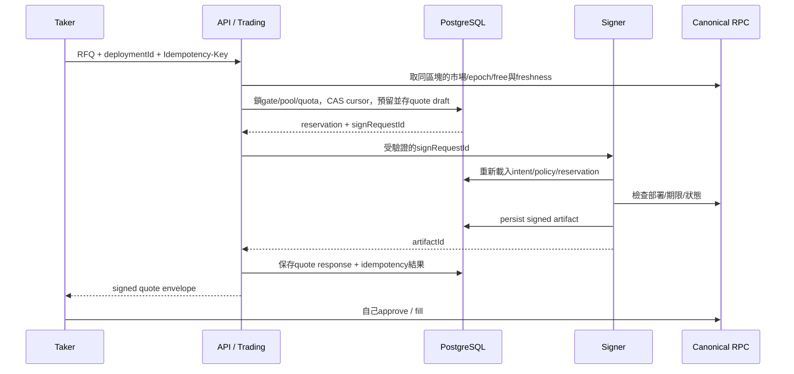

# 04 — RFQ、Signer、Indexer 與故障恢復

## 三種不同狀態

| 實體 | 狀態 | 不能推論的事 |
| --- | --- | --- |
| Quote artifact | DRAFT / SIGN_REQUESTED / SIGNED / SIGN_UNKNOWN / EXPIRED / CANCELLED / CONSUMED | SIGNED不代表上鏈；本機EXPIRED不代表reservation已可釋放 |
| Reservation | HELD / RECONCILE_REQUIRED / ACCOUNTED / RELEASED | RPC timeout或lease失效不能直接RELEASED |
| Tx attempt | CREATED / SIGNED / SUBMITTED / PRECONFIRMED / INCLUDED / FINALIZED；REVERTED / REPLACED / UNKNOWN / REORGED | UNKNOWN不是失敗；INCLUDED不等於L1 finality |

Quote的CONSUMED/CANCELLED是canonical block所觀測結果，附cursor；遇reorg可能恢復有效。ACCOUNTED代表該quote的支出已反映在同cursor free balance，不再另扣reservation；不是「從未有風險」。RELEASED只表示目前核對區塊上無可執行風險，保留歷史供reorg重建。

## 報價順序

取得RPC snapshot後、DB lock等待期間可能有新cursor；transaction必須比對pool.version/cursor，變動就放棄舊snapshot重新讀，不能把新free和舊consumed拼起來。Signer簽前再檢查期限與gate，但仍無法保證maker之後不提款；鏈上驗證是最後防線。

可用額度 = 同cursor makerFreeBalance − 同pool全部HELD/RECONCILE_REQUIRED amounts，ACCOUNTED/RELEASED不重扣。LIVE與REPLAY共用同合約maker free時必須共用資金pool，雖然定價snapshot/統計分開；不可各自把全部free視為可用。

價格只取最近已截止、兩個固定platform forecaster皆合格、age<=24h的同window snapshot。Baseline/external不加入平台平均。機率以millionths整數：p=(p1+p2)/(2*1000000)，YES ask的ceil以整數有理數完成，NO使用同分母補數，再+200並clamp1..9999。

validAfter以已驗證canonical block timestamp生成，expiry=min(validAfter+30,closeAt)。回應時若已到期或剩餘不足以使用，回NO_QUOTE且保留既有artifact/reservation直到對帳；不能暗中延長同digest。clock drift告警，政策不以client clock作真相。

## Signer 內部協定

僅私有網路的mTLS service identity可呼叫。路由按角色分開；research worker identity完全無sign scope。允許的請求只帶signRequestId/intentId與期望payload hash，不接受caller任意calldata或key selector。

Caller → role allowlist：
- quote API：maker quote；不允許maker withdraw/epoch/cancel自動化。
- execution worker：特定內部trader的approveExact/fillQuote/redeem。
- keeper worker：finalizeUnchallenged/finalizeTimeout。
- faucet worker：已核准claim的TestUSD mint。
- ADMIN/proposer/challenger/arbiter：不在服務範圍，人工錢包。

Signer重載deployment manifest、固定to/chain/from、intent、reservation、policy版本；自己由ABI編碼、核對gas/期限/金額。拒絕任意ETH value、未知selector、unlimited approval、錯token/market、過期租約或已取消intent。每角色独立key与nonce guard；maker簽quote不消耗交易nonce。

Sign request唯一鍵防兩份artifact；重試回同一artifact。簽章與DB無法原子commit：實作須先持久化請求與canonical payload，再簽，再保存artifact後才對外回覆；若簽後保存前crash，可重新對相同digest/相同unsigned transaction重建，禁止改payload或分配新nonce。

持久化signed artifact與「可被dispatcher送出」狀態同transaction。只從已保存artifact送交易，不能邊簽邊廣播。單一intent如果需replacement，建立有版本的新attempt、保留同nonce及相同經濟calldata，僅調整gas並重新預留gas上界。

## Reservation解除

| 觀測 | 處理 |
| --- | --- |
| 签署RPC timeout／回應丟失 | SIGN_UNKNOWN + HELD，查signRequest artifact，不簽新quote |
| expiresAt超過本機時間 | 顯示過期，保留資金直到canonical block核對 |
| 同區塊consumed=true | 用該block更新free/positions，再將reservation設ACCOUNTED |
| 同區塊cancelled=true或epoch已失效，且consumed=false | reconcile free後RELEASED |
| canonical block timestamp>=expiresAt且consumed=false | 同區塊free核對後RELEASED |
| maker free下降／pool不一致 | 關gate，保留未決風險、告警、核對提款/成交 |
| provider斷線／finality未知 | 保留風險；finality未知不可偽造FINALIZED |

最新canonical INCLUDED可作v0.1暫時可用狀態；每筆reserve/release/accounting附block hash。若重組撤回該block，先關gate、重建其pool/reservations，再開啟；不能將RELEASED當不可逆terminal。舊quote可能因重組恢復有效，需重新計入，若超額即停止新簽章。無法原子阻止外部錢包fill，合約仍確保實際抵押。

## Indexer

每deployment持有帶fencing token的lease，保存已套用block hash/number。同步流程：
1. 取header，確認parent=目前cursor；不符先找共同祖先。
2. 拉該區段指定contract地址的logs，驗ABI/hash、排序blockNumber/transactionIndex/logIndex。
3. 同DB transaction保存block/events，依事件更新market/position/quote/outcome/escrow projections與cursor；event unique含blockHash。
4. 額外以同區塊contract reads核對makerFree/escrow/positions；讀取採block hash定位，provider不支援時用block number且前後核對header，變動即丟棄。
5. finality由經驗證provider的finalized tag提供；無此能力標UNKNOWN。
6. RFQ gate檢查latest head lag>3 OR last successful update>10s；任一成立即停止。Polling初值1秒，屬工程參數，不是finality承諾。

Reorg：先關gate → 將祖先後events標noncanonical並保留 → 從最近可信checkpoint或deployment block重建受影響projections → 同步新分支 → 同cursor reconcile所有未finalized quote/tx/reservation → 原子更新cursor/gate。

事件動作採冪等reducer；QuoteFilled對雙方各加正確相反side，PositionRedeemed清空其餘額；不可只靠交易status推算份數。MakerRedeem不加free，只有deposit/withdraw/fill影響free。

若跨越已標finalized checkpoint的矛盾，停止自動回復、告警人工核對provider；不悄悄把歷史finalized資料改成其他結果。

## 交易提交與復原

每sender先鎖nonce guard，讀pending/latest nonce與DB allocations對帳，保留占用。重播可用相同raw bytes；replacement同nonce、記replacementOf。Nonce已被未知交易佔用時標UNKNOWN並查鏈，不自動挪到新nonce重做原intent。

外部wallet交易API只追蹤；不幫外部taker分配nonce或代簽。Internal fill不確定時查digest consumed、canonical receipt、事件與position；持倉本身不足以識別單一fill，必須與digest事件關聯。

所有服務重啟先關新交易gate；reconcile尚未完成不ready。救援keeper/read-only查詢可在獨立健康狀態下繼續，不能因quote gate關閉而阻擋permissionless finalize。
